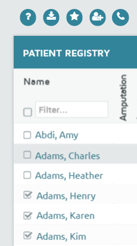
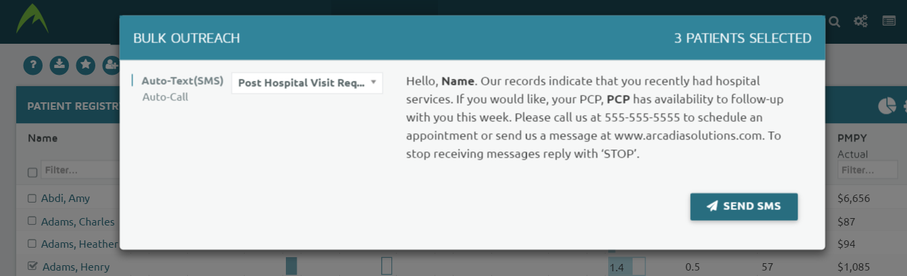

Status: Client-Ready
Author: Luke Shulman
CreateDate: 2016-04-26
ModifyDate: 2016-04-26
AAVersion: 4.10

#Bulk Outreach
The bulk outreach functionality allows users to trigger automated messages to be sent to multiple patients at once and is available as part of the [Care Management](./Care-Management.md) module in the system. 

Please follow the link to the main care management page for more information about the messages types and the templates. 

Bulk outreach can be accessed in two ways:

1. By selecting more than one patient and clicking the 'phone' icon that appears in the toolbar above the report.

2. By selecting the phone icon at the bottom of the report to send a message to all patients on that report. 

On the bulk-outreach menu, the user selects the message type and template to send. After confirmation, the messages will be queued to send. Please note that in can take up to an hour for all calls or messages to be sent. 

Messages are sent with the following restrictions:

1. If a patient is missing any variable value used in the template. The message will Not be sent and a error will be logged. For instance, if a template uses the next appointment but a patient does not have a next appointment in the system their message will error. 
2. If a patient has their death_date populated in the system `t_patient.death_date`. their message will not be sent.
3. If the patient has previously opted out of receiving messages the message will automatically not be sent. 
4. If the patient does not have a phone number or that number is invalid an error will be logged. 
5. Only 1000 messages can be sent in a single batch. 
6. Messages will not be sent during certain hours. The working hours are defined during the installation. 

###Logging
Any message sent is shown on the patient summary [outreach card](../reports/Patient-Summary.md). In addition, the [Outreach Report](../reports/Outreach-Report.md) lists all messages sent. Users can use the Bulk Outreach ID to link messages that were triggered in the same batch. 

