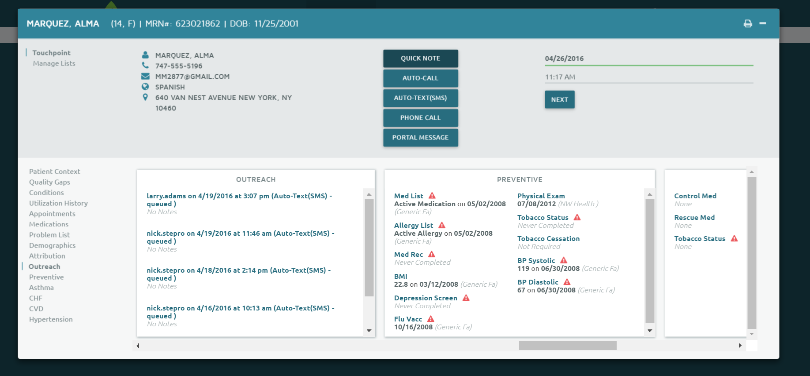
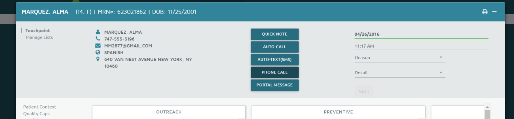

Status: Client-Ready
Author: Luke Shulman
CreateDate: 2016-04-26
ModifyDate: 2016-04-26
AAVersion: 4.10

#Care Management
Arcadia Analytics has an optional module to allow users to engage in care management with patients and engage those patients directly through outreach. The care management functionality had three main goals in mind:

1. **Take Action:** Allow users to use the combined data sources (claims, clinical, HIE) to take impactful actions to improve a coordinate a patient's care. 
2. **Collaboration:** Allow users to see all of the interactions that are helping to improve this patients care. 
3. **Engagement:** Empower users to contact patients and stay in contact with patients in a streamlined workflow. 

Care management adds a number of features to application but is primarily accessed through the 'Action Center' on  the patient summary.



##Action Center
The patient action center allows users with permission to log a touchpoint for a patient. For Care Management users, the following touchpoints are available each of which have a customized workflow to either document contact with a patient that has taken place or to initiate contact through automated means. 

1. **QuickNote:** Document a quick free text note for this patients care management. 
2. **AutoCall:**  Send this patient an automated phonecall using a configured template in the system. 
3. **AutoText:** Send this patient an automated text message using a configured template in the system.
4. **Phone Call:** Document a phone call that has taken place between the user and the patient. This is the workflow by which Care Managers can document thier phone consultations with patients so that other users can collaborate in the system. 
5. **Portal Message:** Document a portal message that was sent to the patient. Many organizations have one or more patient portals that are not able to be integrated to the EHR or Arcadia Analytics. Thus, this workflow allows care coordinators to keep the records up to date for other users in the Arcadia Analytics system. 

To trigger messages to more than one patient at a time, users can use the [Bulk Outreach](./Bulk-Outreach.md) functionality.

To allow for reporting and analysis of Care Management activities, it is important that users choose the correct touchpoint type to reflect their workflow. 

All touchpoints are logged on the  [Patient Summary](../reports/Patient-Summary.md) outreach card.


###QuickNote:


The quicknote functionality allows users to take quick free text note about the patient. The note is saved and shown on the [Patient Summary](../reports/Patient-Summary.md) outreach card.

###AutoCall

The AutoCall functionality allows the user to trigger an automated voice phone call to be sent out to the patient. 

To initiate the call, the user selects one of several templates which form the content of the call. Templates are used so that organizations have better control over the information disclosed through an automated channel. 

The following is a sample template for a voice call in Arcadia Analytics: 

	```
	
	Hello, this is a reminder call for [James Cameron]. When [James Cameron] us available Press 1 otherwise Press 2.  AWAIT RESPONSE 
	
	Hello, this call is a reminder from Arcadia Healthcare Solutions about your upcoming appointment scheduled for [July 4, 2016] at [5:30PM]. We look forward to seeing you. If you need to cancel or reschedule please call us at 555-555-8430. 
	```

The identity confirmation (first statement with patient name) will be played for every voice call. Likewise, a closing statement will enable the recipient to opt-out of receiving future calls at that number. All text messages will also be automatically appended with directions to opt-out of receiving future messages. 

The values enclosed by [brackets] represent the variables that will be populated from the patient’s record. When sending a single message, Arcadia Analytics will show a full preview of the message. When sending messages in a batch to multiple patients a preview of all the messages is not available. If any variable is not populated or invalid the message will not be sent and an error will be logged on the outreach portal. It is advisable to use the fewest number of variables as reasonable in a message to reduce a chance of a system error preventing the message from being sent. 

The following variables are available: Patient Name, Patient Phone Number, Next appointment Datetime, Next Appointment Location, Patient’s Functional PCP, Patients Last Encounter Provider and Patient’s Last Encounter Location. 

Templates are configured and unique for each client customer. Contact your Arcadia Analytics project manager for information about your templates and making updates to them. 

###AutoText

The AutoText functionality allows the user to trigger a automated text message to a patient. Like AutoCall, they text messaging uses templates although separate templates are configured for text messages than for calls. 

###PhoneCall



The Phone call workflow allows for users to document phone calls that they have had with patients or their care givers. The workflow allows the user to document the reason for outreach and the result (whether the patient answered or did not answer or a message was left). 

###Portal Message

The portal message workflow allows for users to document a portal message that has been sent to a patient by the user. In its default configuration, this workflow will not send a message but rather allows for users to keep the care management system up-to-date with communications. 

Many organizations have one or more patient portals that lack the integration points to automate the message. However, it is critical that patient outreach information 

