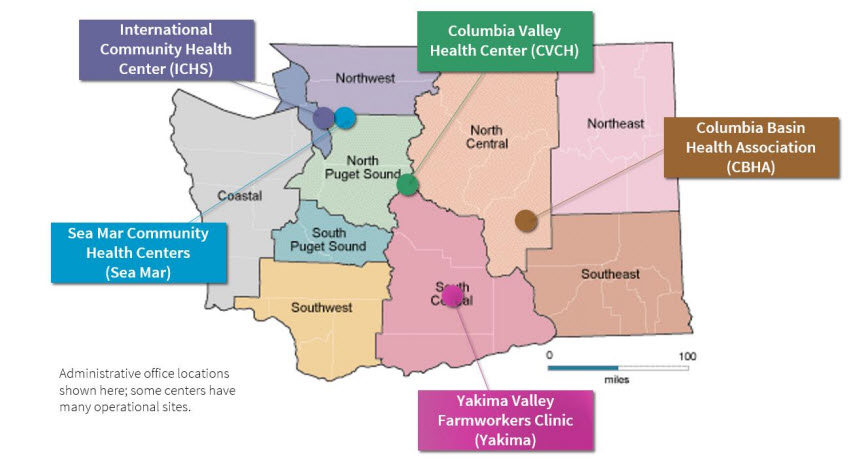
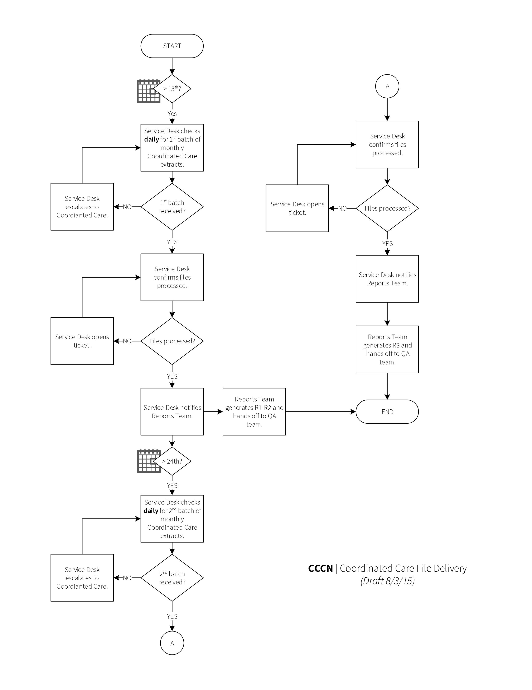

Status: Internal-Only
Author: Author;
CreateDate: 2015-12-16
ModifyDate: 2015-12-16

# Community Care Contracting Network

## Sections:
* [Client Details](#client-details)
* [Overview](#overview)
* [Inbound Data Sources](#inbound-data-sources)
* [Outbound Data Sources](#outbound-data-sources)
* [Custom Procedures and Tables](#custom-procedures-and-tables)
* [External Links](#external-links)
* [Out of Scope](#out-of-scope)

##Client Details
####Client Name
Community Care Contracting Network

####Client Density Area
Northwest

####Client Acronym
CCCN

####Client Contract IDs
Client Contacts

##Overview

###Description
####CCCN is comprised of five separate community health centers in WA:

CEOs from each CHC are members of the CCCN Board and enter into contracts together, but CCCN is not an operational organization.Tactically, we manage each organization and its stakeholders on an individual basis. 

###CCCN Sites

| CHC       | CBHA                                                                                                                                    | CVCH                                                                                                                                                     | ICHS                                                                                                      | Sea Mar                                                                                                                                                                                          | YVFWC                                                                                                                                                                  |
|-----------|-----------------------------------------------------------------------------------------------------------------------------------------|----------------------------------------------------------------------------------------------------------------------------------------------------------|-----------------------------------------------------------------------------------------------------------|--------------------------------------------------------------------------------------------------------------------------------------------------------------------------------------------------|------------------------------------------------------------------------------------------------------------------------------------------------------------------------|
| LOCATIONS | 3                                                                                                                                       | 7                                                                                                                                                        | 7 (4 main)                                                                                                | 50+                                                                                                                                                                                              | 29                                                                                                                                                                     |
| PROVIDERS | 38                                                                                                                                      | 47                                                                                                                                                       | 62                                                                                                        | (many!)                                                                                                                                                                                          | 192                                                                                                                                                                    |
| PATIENTS  | 29,366+                                                                                                                                 | 25,957+                                                                                                                                                  | 21,000+                                                                                                   | 224,519+                                                                                                                                                                                         | 139,369+                                                                                                                                                               |
| SERVICES  | Medical, Dental, Pharmacy, Vision, Lab + X-Ray, WIC, Maternity, Patient Education, Behavioral Health, Infant Toddler Early Intervention | FamilyMedicine, Behavioral Health, Behavioral Medicine, Dental, Diabetes Care, Immunization, Lab + X-Ray, Midwifery, Pediatrics, Pharmacy, Prenatal, WIC | Medical,Dental, Behavioral Health, Pharmacy, Chinese Traditional Medicine, Lab, WIC, Interpreter Services | Medical, Dental, BehavioralHealth –incl. Child and Family Services wraparound program, Preventative Health, Assisted Living, Home Care/Senior Services, Nursing Home, Pharmacy, Nurse Line, etc. | Family, Internal,OB/GYN, Pediatrics, Dental, Behavioral Health, Nutrition, Pharmacy, Lab, Radiology, Employment, Home Visits, New Hope HIV/Aids, Case Management, etc. |
| WEBSITE   | www.cbha.org                                                                                                                            | www.cvch.org                                                                                                                                             | www.ichs.com                                                                                              | www.seamar.org                                                                                                                                                                                   | www.yvfwc.org                                                                                                                                                          |

###Front-end URLs
* [QA Front-End](https://CCCNwebtst01.arcadiahosted.local/) 
* [UAT Front-End](https://CCCNtest.arcadiaanalytics.com/) 
* [PROD Front-End](https://CCCN.arcadiaanalytics.com/)

###Contacts  

##Inbound Data Sources

###Claims
* [CHPW-Claims - CHPWCLM](../Implementations/Sources/CHPWCLM/index.html) **To be implemented Feb 2016**
* [Community Health Plan of Washington (CHPW)](./Sources/CHPW.md)   **To be decommissioned Feb 2016** 
* [Coordinated Care (CCW)](./Sources/CCW.md) 
* [Family Care](./Sources/FAMCAR.md) 
* [Willamette Valley Claims - WVP](../Implementations/Sources/WVP/index.html) - Willamette Valley Community Health. See note on source page on name ambiguity. 

###Clinical

* [Columbia Basin Health Association - CBHA](../Implementations/Sources/CBHA/index.html) 
* [Columbia Valley Community Health Center - CVCH](../Implementations/Sources/CVCH/index.html) 
* [Columbia Valley CHC - CVCHA](../Implementations/Sources/CVCHA/index.html) 
* [International Community Health Services - ICHS](../Implementations/Sources/ICHS/index.html) 
* [Yakima Valley Farm Workers Clinic - YVFWC](../Implementations/Sources/YVFWC/index.html)   - *deprecated; new Epic Connector comming*
* [Yakima Valley Farm Workers Clinic (Epic) - YVFWCE](../Implementations/Sources/YVFWCE/index.html)

##Outbound Data Sources

###Contract Dashboard
* [CCCN Contract Dashboard - CCCNDASH](./Sources/CCCNDASH.md) 

##Outbound Data Sources

###Contract Dashboard
* [CCCN Contract Dashboard - CCCNDASH](./~Sources/CCCNDASH.md) 

###Custom Reports

* R1 – Patient-Member Misalignment 
* R2 – Enrollment Gaps and Recertification
* R3 – Capitation Accuracy Reconciliation

#####Database
* R1 – rpt.uspReportMemberPatientMisalignment
* R2 – rpt.uspReportEnrollmentGapRecertificaiton
* R3 – rpt.uspReportPremiumAccuracyReconcicialition

#####GITHUB:
* R1 – rpt.MemberPatientMisalignment 
* R2 – rpt.EnrollmentGapRecertificaiton
* R3 – rpt.PremiumAccuracyReconciliation

##Out of Scope
Out of scope

##Product Configuration

###Periods Processed
As of January 2016, all non default measures have been disabled. By default the product will dynamically run the  periods for the current week, month, quarter, trailing year and year.

Periods **must** be manually enabled to run for the last 12 months, 12 weeks, 12 quarters and 4 years each time new historical data is loaded or new periods/initiatives are enabled.

###Enabled Measures
* HEDIS
* HEDIS 2016
* P4P 2015
* P4P 2014
* CCO - **enable for YVFWC only**

###Enabled Reports
* Utilization
	* ED Detail
	* ED Frequent Flyer Report
	* Utilization Detail
* Patients
	* High Cost
	* High Risk
	* Non-Engaging (18 Months)
	* Past Visit
	* Patient Registry
	* Significant Event
	* Upcoming Visit
	* Two Year Old Immunization Registry
	* Thirteen Year Old Immunization Registry
* Operations
	* Visit History
	* Order Management
	* Medications and Prescriptions
	* Charge Capture
	* Member Roster
	* Medication Management
	* Readmission Report
	* Attribution Mismatch Detail
	* Discharge Readmission Report

 
##Customization 
###Patient Lists	
[Details Under Development] Member site attribution list- Implemented using the 4.9 feature to sort on custom lists to provide CCCN with the ability to segment members on their plan sourced site attribution. 

#### Report Generation & CCW File Delivery Process

###MPI Customization
In addition to the core MPI logic, the following customization is enabled in CCCN:

**Match Criteria 1**: Normalized First Name, Normalized Last Name, Normalized DOB, and Normalized Gender, and one of the following: SSN, Medicare ID, Zip Code, or City.  
**Match Criteria 2**: First 5 characters of last name, first 3 characters of first name, Normalized DOB, Normalized Gender, and Normalized City.  
**Match Criteria 3**: First 5 characters of last name, First 3 characters of first name, Medicaid ID, Normalized DOB, and Normalized Gender.  

The custom logic can be found in the following procedure:

**dbo.uspFilter\_FuzzyResults\_CCCN.sql** [View on GitHub](https://github.com/arcadia/qdw-cccn/blob/master/Database/MasterPatientIndex/Scripts/uspFilter_FuzzyResults_CCCN.sql)

##Custom Procedures and Tables

#### Warehouse

##### Stored Procedures
* dbo.uspDeletePlanMemberReceipt.sql [View on GitHub](https://github.com/arcadia/qdw-cccn/blob/master/Database/Warehouse/Schema%20Objects/Schemas/dbo/Programmability/uspDeletePlanMemberReceipt.sql)

Procedure to delete data from **dbo.plan\_member_receipt** table. Is executed by the Informatica task flow job. Is currently needed since the premium data gets loaded directly into the warehouse and is a new historical extract. The procedure can take a source parameter to delete only data for a specific source, if left null CCW is selected by default. 

* rpt.Bad\_Provider\_Patient_list.sql
* rpt.CCCN\_MCL_Counts.sql
* rpt.CCW\_analysis_encounters.sql
* rpt.Not\_active\_in_chc.sql
* rpt.Not\_known\_to_chc.sql
* rpt.Provider\_Patient_list.sql
* rpt.ReportEnrollmentGapRecertificationReport.sql
* rpt.ReportInternalBilling.sql
* rpt.ReportMemberPatientMisalignment.sql
* rpt.ReportQualityBonusPerfomance_New.sql
* rpt.ReportQualityBonusPerformance.sql
* rpt.ReportQualityBonusPerformance_New.sql
* rpt.uspMonthlyInvoicePopulationByMCO.sql
* rpt.uspPopulateMemberClinicalSource.sql
* rpt.uspReportCBHAFutureOpportunities.sql
* rpt.uspReportPremiumAccuracy.sql
* rpt.uspUpdateCommonMemberFields.sql
* rpt.uspUpdateCommonPatientFields_custom.sql
* rpt.uspUpdateCustomReportFields.sql

#### Tables
**Tabled for Managed Care Tables**   

* dbo.plan\_member_receipt.sql  [View on GitHub](https://github.com/arcadia/qdw-cccn/blob/master/Database/Warehouse/Schema%20Objects/Schemas/dbo/Tables/plan_member_receipt.sql) 

Custom CCCN table to hold premium data. No corresponding staging table exists and it gets populated directly by the Informatica task flow. Before new data gets loaded, old data gets deleted by dbo.uspDeletePlanMemberReceipt

* dbo.capitation_codes.sql [View on GitHub](https://github.com/arcadia/qdw-cccn/blob/7e90d30871cfacad7bad4b2317f30c10c9c83368/Database/Warehouse/Schema%20Objects/Schemas/lookup/Tables/capitation_codes.sql)

| source\_id | type  | value | fund      |
|-----------|-------|-------|-----------|
| 1001\*/ALL | CPT** | 98812 | fund type |

*source\_id can either be "ALL" or the source_id from dbo.plan_source which corresponds with a plan source like CCW or CHPW  
**could be other items outside of CPT code if needed in the future

Populated by post-deploy script: CapitationCodes.sql [View on GitHub](https://github.com/arcadia/qdw-cccn/blob/d4172883e54ca465919b2d7510b833bf1487f130/Database/Warehouse/Scripts/Post-Deployment/CapitationCodes.sql)

**Tables for R1-R4 reports:**

* rpt.CommonMemberFields.sql
* rpt.CommonPatientFields_custom.sql
* rpt.EnrollmentGapRecertification.sql
* rpt.MemberClinicalSource.sql
* rpt.MemberPatientMisalignment.sql
* rpt.PremiumAccuracy.sql

###Staging

####Stored Procedures
* usp\_implicit\_del\_plan\_member\_assignment_ccw.sql [View on GitHub](https://github.com/arcadia/qdw-cccn/blob/master/Database/Warehouse/Schema%20Objects/Schemas/staging/Programmability/Stored%20Procedures/usp_implicit_del_plan_member_assignment_ccw.sql)
* usp\_implicit\_del\_plan\_member\_elig_ccw.sql [View on GitHub](https://github.com/arcadia/qdw-cccn/blob/master/Database/Warehouse/Schema%20Objects/Schemas/staging/Programmability/Stored%20Procedures/usp_implicit_del_plan_member_elig_ccw.sql)  

**NOTE please do not run historical extracts for assignment and eligibility.** Run only extract for one month which will have historical data. If a historical extract was done for these two tables, run another extract to only pull in the data from the latest load into prestaging. This is due the custom procedures below which deal with source data issues  

The above two procedures get run as part of the nightly job as part of the core implicit delete functionality. This functionality is not used by any other current 4.x implementation but is still currently supported in the product. The procedures will be registered as implicit deletes using uspConfigureImplicitDelete and runs as part of the nightly job before the scrubbing step. The procedures are run before the warehouse load step and when data is present in staging brings in all of the CCW sourced warehouse records in plan member assignment and eligibility into staging as deleted. The intended outcome is to set all CCW records as deleted that were previously in the warehouse but no longer included in the most recent extracts. This is needed because the current CCW extracts are historical but sometimes exclude records that are no longer active or have been deleted at the source. 

####Views
* staging.plan\_member_receipt [View on GitHub](https://github.com/arcadia/qdw-cccn/blob/master/Database/Staging/Schema%20Objects/Schemas/staging/Synonyms/plan_member_receipt.synonym.sql) 

Synonym for the warehouse table **dbo.plan\_member_receipt** Is used to leverage the existing Informatica connection to staging, while populating the warehouse table directly.

##External Links
###Jira Issues
* [Client-Reported Open Issues ](https://jira.arcadiasolutions.com/issues/?jql=%22Impacted%20Data%20Sources%22%20IN%20(CCCN)%20AND%20%22Client%20Reported%20Indicator%22%20%3D%20Yes%20AND%20status%20NOT%20IN%20(Closed))
* [Known Issues](https://jira.arcadiasolutions.com/issues/?jql=%22Impacted%20Data%20Sources%22%20IN%20(CCCN)%20AND%20resolution%20IN%20(%22Known%20Issue%22))
* [Priority Open Issues](https://jira.arcadiasolutions.com/issues/?jql=%22Impacted%20Data%20Sources%22%20IN%20(CCCN)%20AND%20%22Calculated%20Priority%22%20%3C%205%20AND%20status%20NOT%20IN%20(Closed))
* [Unresolved Issues](https://jira.arcadiasolutions.com/issues/?jql=%22Impacted%20Data%20Sources%22%20IN%20(CCCN)%20AND%20status%20NOT%20IN%20(Resolved%2C%20Complete%2C%20%22Deploy%20to%20DEV%22%2C%20%22Deploy%20to%20QA%22%2C%20%22Deploy%20to%20UAT%22%2C%20%22Deploy%20to%20PROD%22%2C%20%22Validate%20in%20DEV%22%2C%20%22Validate%20in%20QA%22%2C%20%22Validate%20in%20QA%22%2C%20%22Validate%20in%20UAT%22%2C%20%22Validate%20in%20PROD%22%2C%20Closed))
* [Resolved Issues Awaiting Deployment](https://jira.arcadiasolutions.com/issues/?jql=%22Impacted%20Data%20Sources%22%20IN%20(CCCN)%20AND%20status%20IN%20(Resolved%2C%20Complete%2C%20%22Deploy%20to%20DEV%22%2C%20%22Deploy%20to%20QA%22%2C%20%22Deploy%20to%20UAT%22%2C%20%22Deploy%20to%20PROD%22%2C%20%22Validate%20in%20DEV%22%2C%20%22Validate%20in%20QA%22%2C%20%22Validate%20in%20QA%22%2C%20%22Validate%20in%20UAT%22%2C%20%22Validate%20in%20PROD%22))
* [Open Issues](https://jira.arcadiasolutions.com/issues/?jql=%22Impacted%20Data%20Sources%22%20IN%20(CCCN)%20AND%20status%20NOT%20IN%20(Closed))
* [On Hold Issues](https://jira.arcadiasolutions.com/issues/?jql=%22Impacted%20Data%20Sources%22%20IN%20(CCCN)%20AND%20status%20IN%20(%22On%20Hold%22%2C%20%22On%20Hold-External%22%2C%20%22On%20Hold-Internal%22))
* [Repo on Github](https://github.com/arcadia/qdw-CCCN) 
* [BOX - SoW](https://arcadia.app.box.com/files/0/f/1570839907/CCCN)
* [Deployment History](https://labs.arcadiaanalytics.com/monitoring_framework/#vhistory)

##Attachments
* Put Relevant Attachments Here

