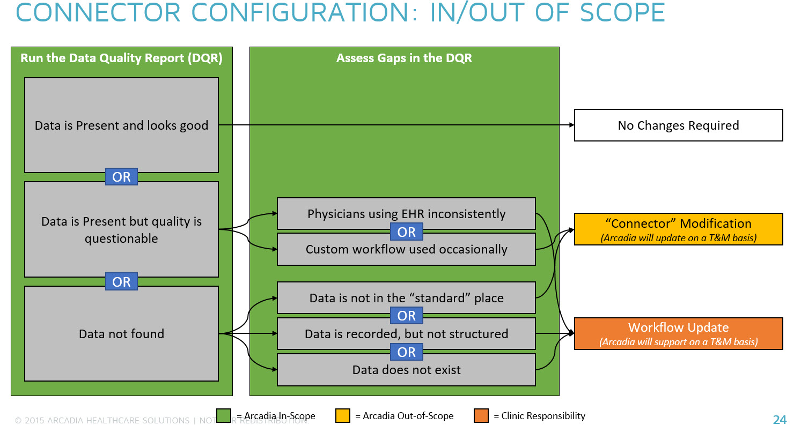

Status: Internal-Only
Author: Author;
CreateDate: 2016-6-5
ModifyDate: 2016-6-5

# MODA

## Sections:
* [Client Details](#client-details)
* [Overview](#overview)
* [Inbound Data Sources](#inbound-data-sources)
* [Outbound Data Sources](#outbound-data-sources)
* [Specifications](#specifications)
* [External Links](#external-links)
* [Scope](#scope)

##Client Details
####Client Name
MODA Health

####Client Density Area
Northwest

####Client Acronym
MODA

####Client Contract IDs
Arcadia Analytics Implementation:1111

##Overview

###Description
Health Plan
###Location
Portland, Oregon

###Servers
MODASQLPRD01  PRD  
MODASQLUAT01  UAT  
MODASQLTST01 (DEV and QA)  

###Front-end URLs
TBD

###Contacts  
* Sean Jessup - sean.jessup@modahealth.com
* Trish Vanderzanden - trish.vanderzanden@modahealth.com

##Inbound Data Sources
###Claims
* MODA Claims - MODAC

###Clinical

* [Harney District Hospital - HDH](../Implementations/Sources/HDH/index.html)
* [Grande Ronde Hospital - GRH](../Implementations/Sources/GRH/index.html)
* St. Alphonsus Medical Group - STALPH
* Treasure Valley Pediatric Clinic - TVPC
* [Yakima Valley Farm Workers Clinic (Epic) - YVFWCE](../Implementations/Sources/YVFWCE/index.html)
* Valley Family Healthcare - VFH
* Good Shepherd Healthcare System - GSHS
* Grande Ronde Hospital - GRH
* Blue Mountain Hospital - BMH
* Columbia River Comm Health Srvs - CRCHS

##Outbound Data Sources
###Report Name
* QRDA3

##Scope

The project is broken down into two phases. Phase II will star upon successful completion of Phase I  September 2016.

Phase I will include integration of at least 2 sites and production of QRDA3. It will also include the first half (eligibility only) MODA Plan connector. 

###In Scope
*For each participant, Arcadia will be responsible for the following activities:*  
* Support identified participants in providing Arcadia access to EHR data  
* Implement the standard connector to each identified EHR  
* Support participant validation of the connector implementation  
* Support participants in identifying where workflow/connector changes are required to meet the EOCCO measurement requirements  
* Generate data extract for 3 EHR-based CCO metrics and 15 EHR-based HEDIS metrics  

###Out of Scope
*The following activities will require a change control or separate SOW:*
* Modifications to the Connector to capture data from non-standard locations in the EHR  
* Recommendations of specific workflow changes for a participant to implement to meet EOCCO measurement requirements or improve measure outcomes  
* Deliver any in-practice coaching to resolve data challenges  

##Configurations
* Measures/Reports
	* **Oregon-Required CCO Measures [QRDA Category 3 Format]**
	* Controlling high blood pressure (NQF 0018) 
	* Depression screening and follow up plan (NQF 0418)
	* Diabetes: HbA1c Poor Control (NQF 0059)
	* HEDIS Quality Measures [HEDIS Supplemental Data File Format]
	* PPC – Timeliness of Prenatal Care & Postpartum Care
	* COL – Colorectal Cancer screening 
	* CDC – Comprehensive Diabetes Care
	* CHL – Chlamydia Screening in Women ages 16-24
	* HPV – Vaccine for adolescent females
	* CIS - Childhood Immunization Status and Components
	* IMA –Adolescent Immunization Status and Components
	* ABA – Adult BMI
	* WCC – Weight Assessment & Counseling for Nutrition and Physical Activity for Children and Adolescents
	* BCS – (Female) Breast Cancer Screening
	* CCS – (Female) Cervical Cancer Screening
	* ADD – Follow-up care after ADHD medication
	* SPR – Use of Spirometry Testing in the Assessment and Diagnosis of COPD
	* CWP - Appropriate Testing for Children With Pharyngitis 
	* URI – Appropriate Treatment for Children With URI
	* AAB – Avoidance of Antibiotic Treatment in Adults With Acute Bronchitis
* Periods Processed
	* Historic/Onetime
	* Weekly
	* Nightly

 
##Customization 
* Custom Schema Elements
* MPI Customization(if any)

##External Links
###Jira Issues
* [JIRA Open Issues](https://jira.arcadiasolutions.com/issues/?jql=labels%20%3D%20MODA)
* [Client-Reported Open Issues ](https://jira.arcadiasolutions.com/issues/?jql=%22Impacted%20Data%20Sources%22%20IN%20(MODA)%20AND%20%22Client%20Reported%20Indicator%22%20%3D%20Yes%20AND%20status%20NOT%20IN%20(Closed))
* [Known Issues](https://jira.arcadiasolutions.com/issues/?jql=%22Impacted%20Data%20Sources%22%20IN%20(MODA)%20AND%20resolution%20IN%20(%22Known%20Issue%22))
* [Priority Open Issues](https://jira.arcadiasolutions.com/issues/?jql=%22Impacted%20Data%20Sources%22%20IN%20(MODA)%20AND%20%22Calculated%20Priority%22%20%3C%205%20AND%20status%20NOT%20IN%20(Closed))
* [Unresolved Issues](https://jira.arcadiasolutions.com/issues/?jql=%22Impacted%20Data%20Sources%22%20IN%20(MODA)%20AND%20status%20NOT%20IN%20(Resolved%2C%20Complete%2C%20%22Deploy%20to%20DEV%22%2C%20%22Deploy%20to%20QA%22%2C%20%22Deploy%20to%20UAT%22%2C%20%22Deploy%20to%20PROD%22%2C%20%22Validate%20in%20DEV%22%2C%20%22Validate%20in%20QA%22%2C%20%22Validate%20in%20QA%22%2C%20%22Validate%20in%20UAT%22%2C%20%22Validate%20in%20PROD%22%2C%20Closed))
* [Resolved Issues Awaiting Deployment](https://jira.arcadiasolutions.com/issues/?jql=%22Impacted%20Data%20Sources%22%20IN%20(MODA)%20AND%20status%20IN%20(Resolved%2C%20Complete%2C%20%22Deploy%20to%20DEV%22%2C%20%22Deploy%20to%20QA%22%2C%20%22Deploy%20to%20UAT%22%2C%20%22Deploy%20to%20PROD%22%2C%20%22Validate%20in%20DEV%22%2C%20%22Validate%20in%20QA%22%2C%20%22Validate%20in%20QA%22%2C%20%22Validate%20in%20UAT%22%2C%20%22Validate%20in%20PROD%22))
* [Open Issues](https://jira.arcadiasolutions.com/issues/?jql=%22Impacted%20Data%20Sources%22%20IN%20(MODA)%20AND%20status%20NOT%20IN%20(Closed))
* [On Hold Issues](https://jira.arcadiasolutions.com/issues/?jql=%22Impacted%20Data%20Sources%22%20IN%20(MODA)%20AND%20status%20IN%20(%22On%20Hold%22%2C%20%22On%20Hold-External%22%2C%20%22On%20Hold-Internal%22))
* [Repo on Github](https://github.com/arcadia/qdw-MODA) 
* [BOX - SoW](https://arcadia.app.box.com/files/0/f/1570839907/MODA)
* [Deployment History](https://labs.arcadiaanalytics.com/monitoring_framework#vhistory)

##Attachments
* Put Relevant Attachments Here

