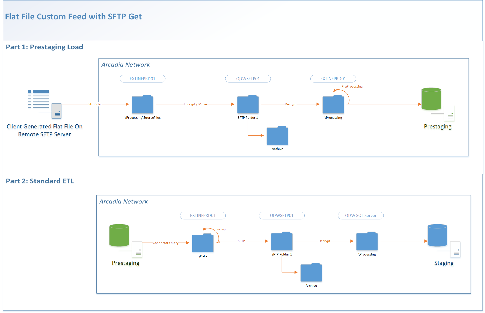

Status: Internal-Only
Author: Jeff Solomon
CreateDate: 2016-01-11
ModifyDate: 2016-01-26

#ACPBCBS (Arizona Community Physicians - Blue Cross Blue Shield Shared Risk)

**Client(s)**: [ACP](../ACP.md)  
**Density Area**: Southwest   

## Sections:
* [Overview](#overview-and-architecture)
* [Custom Configurations](#custom-configurations)
* [Operations](#operations)
* [Data Source](#data-source)
* [Known Issues](#known-issues)
* [External Documentation Links](#external-documents)

##Overview and Architecture

| Overview ||
|-----|-----|
| Data Source Name| **Arizona Community Physicians - Blue Cross Blue Shield Shared Risk** |
| Data Source Acronym| **ACPBCBS** |
| Type | **Claims** |
| Site ID | **6** |
| Architecture Model | [**Client DB Extract (Prestaging w/ SFTP Get)**](../../Tech_Delivery/Standard-Implementations/Client-DB-Extract-Prestaging-SFTP-Get.md)|
| Database hosting | **Arcadia Hosted** |

  

###Database Connection Information  

|Database Connectivity||
|-----|-----|
|Type|MSSQL|
|Host|PRESTGSQLPRD01|
|Port|1433|
|Name|ACPBCBS_PRESTAGING_PRD|
|User Name|ACPBCBS_PRD_PRESTAGING|  

|Remote SFTP Connectivity Info||
|-----|-----|
|Host | remote.azacp.com|
|UserName| arcadia|
|Directory| /dir/BCBSAZ/|
|Port|22|

###Location Hierarchy Configuration

N/A (Claims)

##Custom Configurations

None documented at this time. 

##Data Source

The source of data for this connector is a flat file or set of flat files loaded into prestaging and then transformed during extract.

These files should be loaded from the folder **\\qdwsftp01\0333-PR-ACPBCBS_SFTP_PRD**.  

The files for this connector were build to a slightly out-of-date claims specification. However, they should match the schema of the 4.x plan staging tables for the most part. 

Several exceptions should be noted:  

**Locations**: 
BCBS does not capture structured locations or sites, so they will not be included in the files provided. The impact of this gap is that some filters on the MEM dashboard will not work. 

**Adjustments**: 
For Claims, adjustments will be handled through the delete indicator. See [this thread](https://arcadia.box.com/s/ljx6wp1n3wyg6b05mlqv8twqbpmssggy) for the detailed conversation with the developer. *This conversation also includes details on other file feeds, so should be used as a point of reference regarding all file questions.*  

For Rx Claims, we need to implement custom logic based on this description of the adjustment process:

> Besides the encryption part, I have another issue requesting some work on your side – pharmacy data. The adjustment of this data is different from medical claims. So our original solution for medical claims (adding a deletion flag) would not work. Let me elaborate:

> Rx Claim 001 comes in, approved.
> Rx Claim 002 comes in and reverses Claim 001. 002’s status is “reversal”. However, 001’s status will be either “approved” or “reversed”. The reason is that we get a data feed daily. If the reversal happens in the same day, 001 would be updated to be “reversed” in the source system and transferred to our system. However, if the reversal happen in different dates, 001 is already in our system as “approved” and would not be changed to “reversed”. 
> Rx claim 003 may come in if a correct claim is re-submitted.

> The only way you would know whether an approved claims has been reversed or not is to check whether a reserval claim submitted in the future references to that approved claims. 

> My suggestion:
> 1.       Add a column to indicate which prior claim to reverse.
> 2.       I will give you all data every time regardless of their status. It will be better if the data cleaning is done by your side.

> What do you think? Thanks,

> Quinn Chen

The custom field he refers to is called `reversal_to` and was added to the extract following this conversation.  

Files loaded into prestaging for this source are:  

|planClaimDetails||
|-----|-----|
| Table Name | planClaimDetails|
| File Name Patterne | planClaimDetails|
| Delimiter | ,|
| Text Qualifier | "|
| Fixed Width? | False|
| Has Header? | True|
| Add Row Number? | False|  

**Columns**: claim_detail_id,claim_header_id,member_id,adjudicated_location_id,rendering_provider_id,code_type,code_value,units,adjustment_code,service_from_date,service_thru_date,clam_status,selfpay_ind,netpayment_amount,billed_amount,deductible_amount,allowed_amount,member_responsibility_amount,copay_amount,coinsurance_amount,invoice_date,mod1,mod2,mod3,mod4,line_no,revenue_code,not_covered_amount,paid_amount,interest_amount,check_amount,fee_for_service_equivalent_amt,patient_liab_cost_share_amount,final_processing_status,create_timestamp,modify_timestamp  

|planClaimDiagnosis||
|-----|-----|
| Table Name | planClaimDiagnosis|
| File Name Patterne | planClaimDiagnosis|
| Delimiter | ,|
| Text Qualifier | "|
| Fixed Width? | False|
| Has Header? | True|
| Add Row Number? | False|  

**Columns**: claim_diagnosis_id,claim_header_id,diagnosis_code,diagnosis_code_type,poa_ind,line_no,seq_no,admitting_diag_ind,discharge_diag_ind,emergency_diag_ind,create_timestamp,modify_timestamp  

|planClaimHeader||
|-----|-----|
| Table Name | planClaimHeader|
| File Name Patterne | planClaimHeader|
| Delimiter | ,|
| Text Qualifier | "|
| Fixed Width? | False|
| Has Header? | True|
| Add Row Number? | False|  

**Columns**: claim_header_id,member_id,member_elig_id,admitting_provider_id,billing_provider_id,member_payment_amount,member_payment_date,submitted_date,service_from_date,service_thru_date,pos,admission_date,discharge_date,drg,drg_type,patient_status,claim_frequency,claim_type,form_type,bill_type,claim_no,claim_status,account_no,admission_hour,admission_source,admission_type,admitting_diagnosis,allowed_amount,check_amount,claim_submission_method,fee_for_service_equivalent_amt,final_claim_ind,first_claim_no,medical_record_no,not_covered_amount,paid_amount,patient_control_no,patient_liab_cost_share_amount,received_date,total_billed_amount,create_timestamp,modify_timestamp  

|planClaimRx||
|-----|-----|
| Table Name | planClaimRx|
| File Name Patterne | planClaimRx|
| Delimiter | ,|
| Text Qualifier | "|
| Fixed Width? | False|
| Has Header? | True|
| Add Row Number? | False|  

**Columns**: member_id,nabp_no,rx_no,fill_date,pbm_audit_no,adjustment_status,adjudication_date,refill_no,durg_strength,drug_units,quantity,days_supply,ndc,drug_name,active_ingredients,drug_product_type_code,generic_ind,dosage_form_code,federal_drug_class_code,formulary_ind,compound_ind,daw_code,paid_date,paid_amount,not_covered_amount,deductible_amount,coinsurance_amoutn,copay_amount,billing_copay_amount,passed_copay_amount,ancillary_amount,pbm_processing_fee_amount,tax_amount,un_ind,nc_amount,mac_amount,reimbursement_code,pharmacy_npi,pharmacy_city,pharmacy_state,pharmacy_zip,payee_name,payee_type,submit_type_code,create_timestamp,modify_timestamp,**reversal_to** 

|planGroup||
|-----|-----|
| Table Name | planGroup|
| File Name Patterne | planGroup|
| Delimiter | ,|
| Text Qualifier | "|
| Fixed Width? | False|
| Has Header? | True|
| Add Row Number? | False|  

**Columns**: group_id,group_desc,group_no,create_timestamp,modify_timestamp  

|planLOB||
|-----|-----|
| Table Name | planLOB|
| File Name Patterne | planLOB|
| Delimiter | ,|
| Text Qualifier | "|
| Fixed Width? | False|
| Has Header? | True|
| Add Row Number? | False|  

**Columns**: lob_id,lob_desc,lb_type,create_timestamp,modify_timestamp  

|planMember||
|-----|-----|
| Table Name | planMember|
| File Name Patterne | planMember|
| Delimiter | ,|
| Text Qualifier | "|
| Fixed Width? | False|
| Has Header? | True|
| Add Row Number? | False|  

**Columns**: member_id,first_name,last_name,contact_title,sex,home_phone,business_phone,cell_phone,birth_date,death_date,pregnancy_date,Language,risk,SSN,relationship,race,Attention,address_type,address_line1,address_line2,city,state,zip,county,country,medicaid_id,historical_indicator,create_timestamp,modify_timestamp  

|planMemberAssign||
|-----|-----|
| Table Name | planMemberAssign|
| File Name Patterne | planMemberAssign|
| Delimiter | ,|
| Text Qualifier | "|
| Fixed Width? | False|
| Has Header? | True|
| Add Row Number? | False|  

**Columns**: member_assignment_id,member_id,provider_id,start_date,end_date,assignment_type,cap_amount,create_timestamp,modify_timestamp  

|planMemberElig||
|-----|-----|
| Table Name | planMemberElig|
| File Name Patterne | planMemberElig|
| Delimiter | ,|
| Text Qualifier | "|
| Fixed Width? | False|
| Has Header? | True|
| Add Row Number? | False|  

**Columns**: member_elig_id,member_id,group_id,product_id,mbr_no,mbr_no_suffix,start_date,end_date,term_code,medicare_a_ind,medicare_b_ind,seg_no,otehr_coverage_int_ind,other_coverage_ext_ind,pregnancy_ind,subscriber_only_id,pcp_copay_amount,deductible_amount,drug_coverage_ind,create_timestamp,modify_timestamp  

|planProduct||
|-----|-----|
| Table Name | planProduct|
| File Name Patterne | planProduct|
| Delimiter | ,|
| Text Qualifier | "|
| Fixed Width? | False|
| Has Header? | True|
| Add Row Number? | False|  

**Columns**: product_id,product_desc,lob_id,create_timestamp,modify_timestamp  

|planProvider||
|-----|-----|
| Table Name | planProvider|
| File Name Patterne | planProvider|
| Delimiter | ,|
| Text Qualifier | "|
| Fixed Width? | False|
| Has Header? | True|
| Add Row Number? | False|  

**Columns**: provider_id,business_phone,fax,full_name,first_name,middle_initial,last_name,sex,dob,npi,attention,address_type,address_line1,address_line2,city,state,zip,county,country,dea,primary_specialty,license_no,medicaid_id,tax_id,taxonomy,languiage,create_timestamp,modify_timestamp  

##Operations
|Restriction | |
|-----|-----|
|Time of day extract/access restrictions| None |
|Is the database production?| No, prestaging |
|Frequency of Extracts| TBD  |

##Known Issues

See [Data Source](#data-source) with details on file structure and contents. 

*Additional issues to be documented post-build.* 

##External Documents
- [JIRA Open Issues](https://jira.arcadiasolutions.com/issues/?jql=(labels%20%3D%20ACPBCBS%20or%20%22Data%20Source%20Acronym%22%20~%20ACPBCBS)%20and%20status%20!%3D%20Closed)
- [Connector Deployment History](https://github.com/arcadia/qdw/wiki/connector-version)
- [Build Request](https://arcadia.box.com/s/8y0k8n2itzf918tjwab47avakepz1wil)
- SOW - See ACP page for link. 