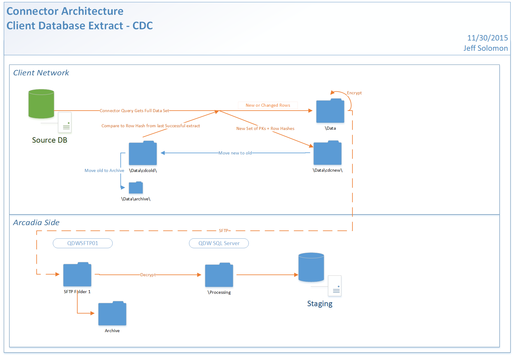

Status: Internal-Only
Author: Jeff Solomon
CreateDate: 2016-01-11
ModifyDate: 2016-02-10

#ACPIDX (Arizona Community Physicians IDX)

**Client(s)**: [ACP](../ACP.md)  
**Density Area**: Southwest   

## Sections:
* [Overview](#overview-and-architecture)
* [Custom Configurations](#custom-configurations)
* [Operations](#operations)
* [Data Source](#data-source)
* [Known Issues](#known-issues)
* [External Documentation Links](#external-documents)

##Overview and Architecture

| Overview ||
|-----|-----|
| Data Source Name| **Arizona Community Physicians IDX** |
| Data Source Acronym| **ACPIDX** |
| Type | **Clinical** |
| Site ID | **7** |
| Architecture Model | [**Client DB Extract (CDC)**](../../Tech_Delivery/Standard-Implementations/Client-DB-Extract-CDC.md)|
| Database hosting | **External** |

###Database Connection Information  

|Database Connectivity||
|-----|-----|
|Type|MSSQL|
|Host|ACP-vAnalyzer|
|Port|1433|
|Name|analyzer_acp|
|User Name|Arcadia|  

###Location Hierarchy Configuration

Standard configuration with rollup to site level location. 

##Custom Configurations

IDX is a PM system, meaning the only queries required for the connector are those concepts typically found in a PM (patient, appointments, encounters, charges, payers). This connector pulls this PM data from the same data source as [ACPCLN](./ACPCLN.md), and is critically important for the ACP project because it contains all of the chargecapture data that is unavailable in AllScripts for ACPCLN.

###Test Patient Filter

Test patient loads are conducted by modifying the extract tasks in DEV the two key parameters are:
1. testpatientswitchbit : this is set to 1 or 0. 1 turns the filter on, 0 turns it off
2. testpatientclientidlist ; this is a list of ids for patients whose data you wish to pull - this should be all test patients. Ideally this is set up as part of the integration, less ideally it will be the patient_original_ids for each patient in every open ticket.

to use the filter set the above in each query in the connector studio tasks pane. Set each query switchbit to 1 and include your list 'id one', 'id two',... 'id n' in every testpatientclientidlist field.  Then push the tasks to the cloud, run the DEV extract and proceed as usual. The highly constrainted data pull results in a faster job run and will allow you to focus on fixing issues faster.

##Data Source

The data for this connector is pulled from [IDX Practice Management 0](../../Tech_Delivery/EHR-Documentation/IDX-Practice-Management.md).

##Operations
|Restriction | |
|-----|-----|
|Time of day extract/access restrictions| Extract after business hours |
|Is the database production?| **Yes** |
|Frequency of Extracts| Nightly |

##Known Issues

See [handoff](https://arcadia.box.com/s/qwbao3veo87v4fuhn4bsl99rqj3pefh7).

* Known Issues and Unvalidated Data Spreadsheet [Click Here](https://arcadia.app.box.com/files/0/f/1888547619/4._Client_Specific_Material)

##External Documents
- [JIRA Open Issues](https://jira.arcadiasolutions.com/issues/?jql=(labels%20%3D%20ACPIDX%20or%20%22Data%20Source%20Acronym%22%20~%20ACPIDX)%20and%20status%20!%3D%20Closed)
- [Connector Deployment History](https://github.com/arcadia/qdw/wiki/connector-version)
- [Build Request](https://arcadia.box.com/s/vxiyb896smb57q35odn7vrh2xd0cwqf9)
- SOW - See [ACP](../ACP.md) Page 