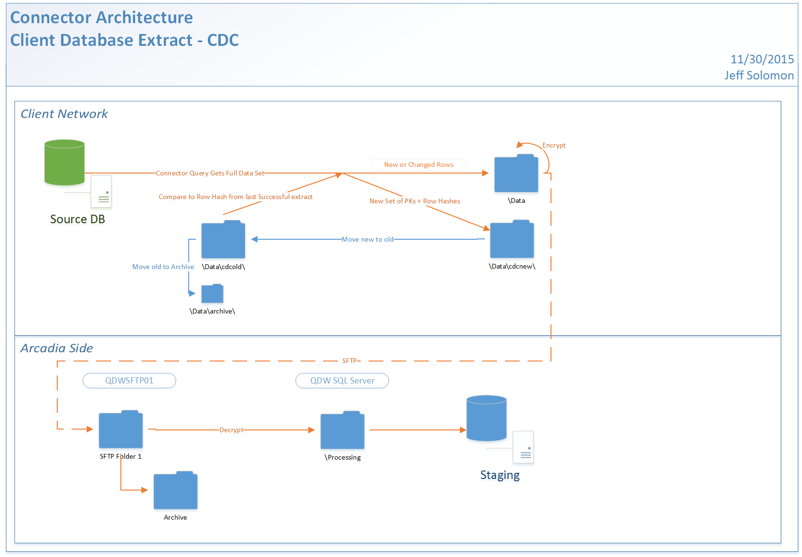

Status: Internal-Only
Author: Nick Daniel
CreateDate: 2016-01-11
ModifyDate: 2016-05-3

#ARNOT (Arnot Ogden Medical Center)

**Client(s)**: [AHP](../AHP.md), [XCLS](../XCLS.md)  
**Density Area**: New York   

## Sections:
* [Overview](#overview-and-architecture)
* [Custom Configurations](#custom-configurations)
* [Operations](#operations)
* [Data Source](#data-source)
* [Known Issues](#known-issues)
* [External Documentation Links](#external-documents)

##Overview and Architecture

| Overview ||
|-----|-----|
| Data Source Name| **Arnot Ogden Medical Center** |
| Data Source Acronym| **ARNOT** |
| Type | **Clinical** |
| Site ID | **62** |
| Architecture Model | [**Client DB Extract (CDC)**](../../Tech_Delivery/Standard-Implementations/Client-DB-Extract-CDC.md)|
| Database hosting | **External** |

###Database Connection Information  

|Database Connectivity||
|-----|-----|
|Type|MSSQL|
|Host|10.250.1.140|
|Port|1433|
|Name|mobiledoc|
|User Name|sa|  

###Location Hierarchy Configuration

* AHP
    * AHP Community
        * Arnot Ogden Medical Center
            * Pain Management
            * Endocrinology
            * Arnot Ogden Medical Center Unknown Location
            * Administrative Arnot Medical Srvs
            * AMS Physician Billing
            * AOMC Emergency Department
            * AOMC Inpatient Services
            * AOMC Outpatient Services
            * AOMC Quick Care
            * AOMC Radiology
            * Arnot Health Inc.
            * Bethany Clinic
            * Bethany Nursing Home & Snf
            * Cancer Screening Services
            * Cardiology Bath
            * Cardiology Horseheads
            * Cardiology Interventional
            * Cardiology Ivy II
            * Cardiology Madison
            * Corning Hospital Inpatient
            * DaVita Corning Dialysis
            * Disease Management
            * Electrophysiology
            * ENT Allergy Facial Plastics
            * Family Medicine Addison
            * Family Medicine Addison Recovery Medicine
            * Family Medicine Avoca
            * Family Medicine Bath
            * Family Medicine Big Flats
            * Family Medicine Canton
            * Family Medicine Corning
            * Family Medicine Orchard
            * Family Medicine Orchard East
            * Family Medicine Orchard West
            * Family Medicine Southport
            * Family Medicine Troy
            * Gastroenterology Elmira
            * Gastroenterology Horseheads
            * Infectious Disease
            * Internal Medicine Big Flats
            * Internal Medicine Big Flats Recovery Medicine
            * Internal Medicine Denison
            * Internal Medicine Horseheads
            * Internal Medicine Ivy 205
            * Internal Medicine Ivy 208
            * Internal Medicine Ivy II
            * Internal Medicine Southport
            * IRA Emergency Department
            * IRA Inpatient Services
            * IRA Outpatient Services
            * IRA Skilled Nursing Facility
            * Ivy Clinic
            * Madison Specialty
            * Multispecialty Bath
            * Multispecialty IMAST
            * Nephrology
            * Neurology Corning
            * Neurology Wellsboro
            * Neurology Westinghouse
            * OBGYN Health Center For Women
            * OBGYN Horseheads
            * Occupational Medicine
            * Occupational Medicine - Employee Health
            * Orthopedic Surgery Bath
            * Orthopedic Surgery Hoffman
            * Orthopedic Surgery Horseheads
            * Orthopedic Surgery Madison
            * Pain Management Center
            * Patients Home
            * Primary Care Eastside
            * Primary Care Eastside Recovery Medicine
            * Primary Care Erwin
            * Primary Care Madison
            * Primary Care Watkins
            * Rheumatology
            * Schuyler Hospital OP Services
            * St Josephs Hospital BSU
            * St Josephs Hospital ED
            * St Josephs Hospital IP Services
            * St Josephs Hospital OP Services
            * St Josephs Hospital Rehab IP
            * St Josephs Hospital Rehab OP
            * St Josephs Hospital SNF
            * Surgery General Bariatrics
            * Surgery General Cardiothoracic
            * Urology
            * Vestal IME Site
            * Walk In Care Erwin
            * Walk In Care Horseheads
            * Walk In Care Southport
            * Walk In Care Troy
            * zArnot Ogden Medical Center
            * zBath Veterans Administrative Medical Center
            * zFinger Lakes Visiting Nurse Services
            * zIRA Davenport Hospital
            * zNuerology Services
            * zPathology Services
            * zz Arnot Health Inc.
            * Pulmonary

##Custom Configurations

None documented at this time. 

##Data Source

The data for this connector is pulled from [eCW 10](../../Tech_Delivery/EHR-Documentation/eCW.md).

##Operations
|Restriction | |
|-----|-----|
|Time of day extract/access restrictions| None |
|Is the database production?| No, replicated DB. |
|Frequency of Extracts| Daily |

##Known Issues

The primary keys that are being extracted for the vitals tables are not unique.  This was discovered during a redgate between AHP and XCLS and the net impact is a slight variance in BMI values, between .3 and .7, depending on which record is extracted.  This was found in .00194% of all vitals rows and given the minor impact it has it was decided that it was not worth the effort to fix at this point in time.

##External Documents
- [JIRA Open Issues](https://jira.arcadiasolutions.com/issues/?jql=(labels%20%3D%20ARNOT%20or%20%22Data%20Source%20Acronym%22%20~%20ARNOT)%20and%20status%20!%3D%20Closed)
- [Connector Deployment History](https://github.com/arcadia/qdw/wiki/connector-version)
- Build Request (*Whereabouts unknown. Follow up with the Solution Architect with questions or location of file*)
- [Connector Handoff](https://arcadia.box.com/s/x55rl7x1x0f268t54thnkb7yj2nz8kfn)
- [SOW](https://arcadia.box.com/s/81vmvio34xf2brxqw8u7)