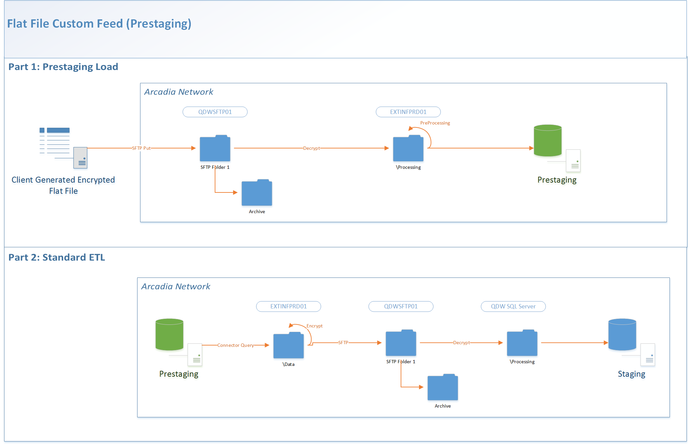

Status: Internal-Only
Author: Simon Ioffe
CreateDate: 2016-01-11
ModifyDate: 2016-01-11

#CHPWCLM (CHPW-Claims)

**Client(s)**: [CCCN](../CCCN.md), [CHPW](../CHPW.md)  
**Density Area**: Northwest   

## Sections:
* [Overview](#overview-and-architecture)
* [Custom Configurations](#custom-configurations)
* [Operations](#operations)
* [Data Source](#data-source)
* [Known Issues](#known-issues)
* [External Documentation Links](#external-documents)

##Overview and Architecture

| Overview ||
|-----|-----|
| Data Source Name| **CHPW-Claims** |
| Data Source Acronym| **CHPWCLM** |
| Type | **Claims** |
| Site ID | **20** |
| Architecture Model | [**Client DB Extract (Prestaging)**](../../Tech_Delivery/Standard-Implementations/Client-DB-Extract-Prestaging.md)|
| Database hosting | **Arcadia Hosted** |

###Database Connection Information  

|Database Connectivity||
|-----|-----|
|Type|MSSQL|
|Host|PRESTGSQLPRD01|
|Port|1433|
|Name|CHPWCLM_PRESTAGING_PRD|
|User Name|CHPWCLM_PRD_PRESTAGING|  

###Location Hierarchy Configuration

*Not documented at this time. Contact the Solution Architect for details.*

##Custom Configurations

###CHPW Connector:
Contains the same data and seeds  as the previous CHPW connector: [CHPW Claims - CHPWC](../~Implementations/~Sources/CHPWC/index.html). The only difference is it is being loaded into the pre-staging database first. Uses the same source_id and original_id.

###CCCN Connector:
Includes many improvements from the previous CCCN-CHPW connector: [CHPW](../~Implementations/~Sources/CHPW/index.html) Contains the same base data and seeds as the previous CHPW-CHPW connector: [CHPW Claims - CHPWC](../~Implementations/~Sources/CHPWC/index.html). 

Uses a new source id, "CHPW", different than both the old CCCN-CHPW and new CHPCLM connector for CHPW. Because of this it will be registered as a new source in addition to the old connector.  Seeds are now consistent with CHPW and new seeds should be added and processed for both connectors.

##Data Source

The source of data for this connector is a flat file or set of flat files loaded into prestaging and then transformed during extract.  
These files should be loaded from the folder **\\qdwsftp01\0288-PR-CHPWCLM_SFTP_PRD**.  
Files loaded into prestaging for this source are:  

|BillingProvider||
|-----|-----|
| Table Name | BillingProvider|
| File Name Pattern | _planBillingProvider_|
| Delimiter | ,|
| Text Qualifier | "|
| Fixed Width? | False|
| Has Header? | True|
| Add Row Number? | False|  

**Columns**: center_id, billing_provider_id, orig_billing_provider_id, billing_provider_type, billing_provider_type_unscrubbed, name, business_phone, fax, tax_id, billing_provider_1099_ind, primary_npi, npi_exempt_ind, source_id, orig_source_id, insert_timestamp, update_timestamp, create_timestamp, modify_timestamp, created_by, modified_by, delete_ind, loaded_from_file, physical_address_id, mailing_address_id, billing_address_id, secondary_address_id, orig_physical_address_id, orig_mailing_address_id, orig_billing_address_id, orig_secondary_address_id  

|BillingProviderAddress||
|-----|-----|
| Table Name | BillingProviderAddress|
| File Name Pattern | _planBillingProviderAddress_|
| Delimiter | ,|
| Text Qualifier | "|
| Fixed Width? | False|
| Has Header? | True|
| Add Row Number? | False|  

**Columns**: center_id, billing_provider_address_id, orig_billing_provider_address_id, billing_provider_id, orig_billing_provider_id, primary_address_ind, address_type, address_type_unscrubbed, address_line1, address_line2, city, state, zip, county_unscrubbed, county, country, source_id, orig_source_id, insert_timestamp, update_timestamp, create_timestamp, modify_timestamp, created_by, modified_by, delete_ind, loaded_from_file  

|BillingProviderNPI||
|-----|-----|
| Table Name | BillingProviderNPI|
| File Name Pattern | _planBillingProviderNPI_|
| Delimiter | ,|
| Text Qualifier | "|
| Fixed Width? | False|
| Has Header? | True|
| Add Row Number? | False|  

**Columns**: center_id, billing_provider_npi_id, orig_billing_provider_npi_id, billing_provider_id, orig_billing_provider_id, npi, primary_npi_ind, start_date_unscrubbed, start_date, end_date_unscrubbed, end_date, term_reason, term_reason_unscrubbed, inactive_ind, source_id, orig_source_id, insert_timestamp, update_timestamp, create_timestamp, modify_timestamp, created_by, modified_by, delete_ind, loaded_from_file  

|Capitation||
|-----|-----|
| Table Name | Capitation|
| File Name Pattern | _planCapitation_|
| Delimiter | ,|
| Text Qualifier | "|
| Fixed Width? | False|
| Has Header? | True|
| Add Row Number? | False|  

**Columns**: center_id, capitation_id, member_month_id, member_elig_id, orig_member_elig_id, provider_id, orig_provider_id, product_id, orig_product_id, lob_id, orig_lob_id, location_id, orig_location_id, site_id, orig_site_id, member_id, orig_member_id, mbr_no, mbr_no_suffix, payment_type, remuneration, start_date, end_date, run_date, paid_date, manual_payment_ind, orig_source_id, source_id, orig_capitation_id, insert_timestamp, update_timestamp, create_timestamp, modify_timestamp, created_by, modified_by, delete_ind, loaded_from_file, company_code, ra_site_id, orig_ra_site_id  

|ClaimDiagnosis||
|-----|-----|
| Table Name | ClaimDiagnosis|
| File Name Pattern | _planClaimDiagnosis_|
| Delimiter | ,|
| Text Qualifier | "|
| Fixed Width? | False|
| Has Header? | True|
| Add Row Number? | False|  

**Columns**: claim_diagnosis_id, claim_header_id, diagnosis_code_unscrubbed, diagnosis_code_type, source_id, poa_ind, line_no, seq_no, admitting_diag_ind, discharge_diag_ind, emergency_diag_ind, create_timestamp, modify_timestamp, created_by, modified_by, delete_ind, loaded_from_file, diagnosis_code_type_unscrubbed  

|ClaimHeader||
|-----|-----|
| Table Name | ClaimHeader|
| File Name Pattern | _planClaimHeader_|
| Delimiter | ,|
| Text Qualifier | "|
| Fixed Width? | False|
| Has Header? | True|
| Add Row Number? | False|  

**Columns**: center_id, claim_header_id, orig_claim_header_id, claim_type, claim_type_unscrubbed, claim_no, first_claim_no, final_claim_ind, member_id, orig_member_id, adjudicated_lob_id, orig_adjudicated_lob_id, billing_provider_id, orig_billing_provider_id, admitting_provider_id, orig_admitting_provider_id, attending_provider_id, orig_attending_provider_id, referring_provider_id, orig_referring_provider_id, provider_contract_id, orig_provider_contract_id, service_from_date, service_from_date_unscrubbed, service_thru_date, service_thru_date_unscrubbed, admission_date, admission_date_unscrubbed, discharge_date, discharge_date_unscrubbed, received_date, claim_status, bill_type, claim_frequency, patient_status, admission_type, admission_source, admission_hour, discharge_hour, admitting_diagnosis, admitting_diagnosis_unscrubbed, drg_type, drg_type_unscrubbed, drg, submitted_drg, submitted_total_billed_amount, allowed_amount, not_covered_amount, deductible_amount, copay_amount, coinsurance_amount, paid_amount, interest_amount, check_amount, fee_for_service_equivalent_amount, COB_paid_amount, provider_write_off_amount, patient_liab_cost_share_amount, claim_submission_method, medical_record_no, patient_control_no, orig_authorization_id, source_id, orig_source_id, insert_timestamp, update_timestamp, create_timestamp, modify_timestamp, created_by, modified_by, delete_ind, loaded_from_file, person_id, diagnosis_type, diagnosis_1, diagnosis_1_unscrubbed, diagnosis_2, diagnosis_2_unscrubbed, diagnosis_3, diagnosis_3_unscrubbed, diagnosis_4, diagnosis_4_unscrubbed, procedure_type, procedure_1, procedure_1_unscrubbed, procedure_2, procedure_2_unscrubbed, procedure_3, procedure_3_unscrubbed, procedure_4, procedure_4_unscrubbed, DRG_Processed_Ind  

|ClaimLine||
|-----|-----|
| Table Name | ClaimLine|
| File Name Pattern | _planClaimLine_|
| Delimiter | ,|
| Text Qualifier | "|
| Fixed Width? | False|
| Has Header? | True|
| Add Row Number? | False|  

**Columns**: center_id, claim_line_id, orig_claim_line_id, claim_header_id, orig_claim_header_id, line_no, claim_type, payment_status, adjustment_status, capitation_ind, member_id, orig_member_id, adjudicated_member_elig_id, orig_adjudicated_member_elig_id, adjudicated_product_id, orig_adjudicated_product_id, adjudicated_lob_id, orig_adjudicated_lob_id, adjudicated_site_id, orig_adjudicated_site_id, adjudicated_location_id, orig_adjudicated_location_id, rendering_provider_id, orig_rendering_provider_id, pos, procedure_code, procedure_code_type, procedure_modifier_1, procedure_modifier_2, procedure_modifier_3, procedure_modifier_4, revenue_code, service_from_date, service_thru_date, units, billed_amount, allowed_amount, not_covered_amount, deductible_amount, copay_amount, coinsurance_amount, paid_amount, interest_amount, check_amount, fee_for_service_equivalent_amount, COB_paid_amount, provider_write_off_amount, patient_liab_cost_share_amount, benefit_category, source_id, orig_source_id, insert_timestamp, update_timestamp, create_timestamp, modify_timestamp, created_by, modified_by, delete_ind, loaded_from_file, member_month_id, person_id, ndc_code, company_code, mr_line_detail, mr_line_case, days_procedures, admits_cases, continuous_stay_claim_id, milliman_procedure_code_family_id, pbp_line, pbp_case_admit, medicare_covered, ppaca, avoidable_er_ind, avoidable_ip_ind  

|ClaimLineDetail||
|-----|-----|
| Table Name | ClaimLineDetail|
| File Name Pattern | _planClaimLineDetail_|
| Delimiter | ,|
| Text Qualifier | "|
| Fixed Width? | False|
| Has Header? | True|
| Add Row Number? | False|  

**Columns**: center_id, claim_line_detail_id, orig_claim_line_detail_id, claim_header_id, orig_claim_header_id, line_no, claim_type, claim_type_unscrubbed, payment_status, payment_status_unscrubbed, adjustment_status, processing_status, processing_status_unscrubbed, hold_ind, canceled_ind, reversed_ind, capitation_ind, member_id, orig_member_id, adjudicated_member_elig_id, orig_adjudicated_member_elig_id, adjudicated_product_id, orig_adjudicated_product_id, adjudicated_lob_id, orig_adjudicated_lob_id, adjudicated_site_id, orig_adjudicated_site_id, adjudicated_location_id, orig_adjudicated_location_id, rendering_provider_id, orig_rendering_provider_id, pos, procedure_code, procedure_code_type, procedure_code_type_unscrubbed, procedure_modifier_1, procedure_modifier_2, procedure_modifier_3, procedure_modifier_4, revenue_code, service_from_date, service_from_date_unscrubbed, service_thru_date, service_thru_date_unscrubbed, units, billed_amount, allowed_amount, not_covered_amount, deductible_amount, copay_amount, coinsurance_amount, paid_amount, interest_amount, check_amount, fee_for_service_equivalent_amount, COB_paid_amount, provider_write_off_amount, patient_liab_cost_share_amount, check_date, benefit_category, orig_accounts_payable_transaction_id, source_id, orig_source_id, insert_timestamp, update_timestamp, create_timestamp, modify_timestamp, created_by, modified_by, delete_ind, loaded_from_file, person_id, member_month_id, ndc_code, claim_line_detail_status, post_date, general_ledger_reference_code, company_code, mr_line_detail, mr_line_case, days_procedures, admits_cases, continuous_stay_claim_id, milliman_procedure_code_family_id, pbp_line, pbp_case_admit, medicare_covered, ppaca, avoidable_er_ind, avoidable_ip_ind  

|ClaimRx||
|-----|-----|
| Table Name | ClaimRx|
| File Name Pattern | _planClaimRx_|
| Delimiter | ,|
| Text Qualifier | "|
| Fixed Width? | False|
| Has Header? | True|
| Add Row Number? | False|  

**Columns**: center_id, claim_rx_id, orig_claim_rx_id, nabp_no, rx_no, fill_date, pbm_audit_no, adjustment_status, adjustment_status_unscrubbed, adjudication_date, refill_no, drug_strength, drug_units, quantity, days_supply, ndc, drug_name, drug_generic_code, drug_product_type_code, drug_product_type_code_unscrubbed, generic_ind, dosage_form_code, dosage_form_code_unscrubbed, federal_drug_class_code, federal_drug_class_code_unscrubbed, formulary_ind, compound_ind, daw_code, daw_code_unscrubbed, paid_date, paid_amount, billed_amount, not_covered_amount, deductible_amount, coinsurance_amount, copay_amount, billing_copay_amount, passed_copay_amount, ancillary_amount, pbm_processing_fee_amount, tax_amount, uc_ind, uc_amount, mac_amount, reimbursement_code, reimbursement_code_unscrubbed, ingr_cost_amount, dispensing_fee_amount, awp_amount, lics_subsidy_amount, retro_lics_subsidy_amount, retro_lics_code, retro_lics_code_unscrubbed, member_id, orig_member_id, orig_authorization_id, adjudicated_lob_id, orig_adjudicated_lob_id, adjudicated_payor_id, orig_adjudicated_payor_id, pcp_provider_id, orig_pcp_provider_id, adjudicated_site_id, orig_adjudicated_site_id, pharmacy_npi, payee_name, payee_type, payee_type_unscrubbed, prescriber_id, orig_prescriber_id, prescriber_npi, prescriber_dea_no, submit_type_code, submit_type_code_unscrubbed, received_date, source_id, orig_source_id, insert_timestamp, update_timestamp, create_timestamp, modify_timestamp, created_by, modified_by, delete_ind, loaded_from_file, drug_name_unscrubbed, member_month_id, person_id, tpa, mr_line_detail, mr_line_case, days_procedures, admits_cases, continuous_stay_claim_id, milliman_procedure_code_family_id, pbp_line, pbp_case_admit, medicare_covered, ppaca, medicare_b_claim_ind, medicare_b_drug_ind, adjudicated_plan_no  

|Lob||
|-----|-----|
| Table Name | Lob|
| File Name Pattern | _planLob_|
| Delimiter | ,|
| Text Qualifier | "|
| Fixed Width? | False|
| Has Header? | True|
| Add Row Number? | False|  

**Columns**: center_id, lob_id, lob_label_unscrubbed, payor_id, orig_payor_id, lob_desc_unscrubbed, lob_type_unscrubbed, lob_type, orig_source_id, source_id, orig_lob_id, insert_timestamp, update_timestamp, create_timestamp, modify_timestamp, created_by, modified_by, delete_ind, loaded_from_file, lob_desc, lob_label  

|Location||
|-----|-----|
| Table Name | Location|
| File Name Pattern | _planLocation_|
| Delimiter | ,|
| Text Qualifier | "|
| Fixed Width? | False|
| Has Header? | True|
| Add Row Number? | False|  

**Columns**: center_id, location_id, location_desc, handicap_access_ind, tdd_ind, source_id, orig_source_id, orig_location_id, insert_timestamp, update_timestamp, create_timestamp, modify_timestamp, created_by, modified_by, delete_ind, loaded_from_file, physical_address_id, billing_address_id, orig_physical_address_id, orig_billing_address_id  

|LocationAddress||
|-----|-----|
| Table Name | LocationAddress|
| File Name Pattern | _planLocationAddress_|
| Delimiter | ,|
| Text Qualifier | "|
| Fixed Width? | False|
| Has Header? | True|
| Add Row Number? | False|  

**Columns**: center_id, location_address_id, location_id, orig_location_id, attention, address_type_unscrubbed, address_type, address_line1, address_line2, city, state, zip, county_unscrubbed, county, country, longitude, latitude, start_date_unscrubbed, start_date, end_date_unscrubbed, end_date, orig_location_address_id, orig_source_id, source_id, insert_timestamp, update_timestamp, create_timestamp, modify_timestamp, created_by, modified_by, delete_ind, loaded_from_file  

|Member||
|-----|-----|
| Table Name | Member|
| File Name Pattern | _planMember_|
| Delimiter | ,|
| Text Qualifier | "|
| Fixed Width? | False|
| Has Header? | True|
| Add Row Number? | False|  

**Columns**: center_id, member_id, first_name, middle_name, last_name, contact_title, sex_unscrubbed, sex, home_phone, business_phone, cell_phone, dob, death_date, head_of_household_name, pregnancy_date, first_covered_date, special_needs_unscrubbed, special_needs, individual_no, language_unscrubbed, language, risk_unscrubbed, risk, marital_status_unscrubbed, marital_status, ssn, relationship_unscrubbed, relationship, ethnicity_unscrubbed, ethnicity, medicaid_id, medicare_id, orig_source_id, source_id, orig_member_id, insert_timestamp, update_timestamp, create_timestamp, modify_timestamp, created_by, modified_by, delete_ind, loaded_from_file, home_address_id, mailing_address_id, orig_home_address_id, orig_mailing_address_id, mbr_no, mbr_no_suffix, prism_risk_score, prism_high_risk_score_ind, high_risk_ind, medicare_part_a_risk_score, medicare_part_a_high_risk_ind, Email, PRC_IND  

|MemberAddress||
|-----|-----|
| Table Name | MemberAddress|
| File Name Pattern | _planMemberAddress_|
| Delimiter | ,|
| Text Qualifier | "|
| Fixed Width? | False|
| Has Header? | True|
| Add Row Number? | False|  

**Columns**: center_id, member_address_id, member_id, orig_member_id, attention, address_type_unscrubbed, address_type, address_line1, address_line2, city, state, zip, county_unscrubbed, county, country, longitude, latitude, start_date_unscrubbed, start_date, end_date_unscrubbed, end_date, orig_member_address_id, orig_source_id, source_id, insert_timestamp, update_timestamp, create_timestamp, modify_timestamp, created_by, modified_by, delete_ind, loaded_from_file, HOME_PHONE_NUMBER  

|MemberAssignment||
|-----|-----|
| Table Name | MemberAssignment|
| File Name Pattern | _planMemberAssignment_|
| Delimiter | ,|
| Text Qualifier | "|
| Fixed Width? | False|
| Has Header? | True|
| Add Row Number? | False|  

**Columns**: center_id, member_assignment_id, member_id, orig_member_id, provider_id, orig_provider_id, location_id, orig_location_id, site_id, orig_site_id, start_date, end_date, assignment_type_unscrubbed, assignment_type, orig_source_id, source_id, orig_member_assignment_id, insert_timestamp, update_timestamp, create_timestamp, modify_timestamp, created_by, modified_by, delete_ind, loaded_from_file  

|MemberElig||
|-----|-----|
| Table Name | MemberElig|
| File Name Pattern | _planMemberElig_|
| Delimiter | ,|
| Text Qualifier | "|
| Fixed Width? | False|
| Has Header? | True|
| Add Row Number? | False|  

**Columns**: center_id, member_elig_id, member_id, orig_member_id, product_id, orig_product_id, mbr_no, mbr_no_suffix, start_date_unscrubbed, start_date, end_date_unscrubbed, end_date, term_code_unscrubbed, term_code, pregnancy_ind, subscriber_only_ind, medicare_a_ind, medicare_b_ind, pcp_copay_amount, deductible_amount, re_cert_date, seq_no, other_coverage_int_ind, other_coverage_ext_ind, drug_coverage_ind_unscrubbed, drug_coverage_ind, premium_amount, orig_source_id, source_id, orig_member_elig_id, insert_timestamp, update_timestamp, create_timestamp, modify_timestamp, created_by, modified_by, delete_ind, loaded_from_file, member_smoker_ind  

|MemberMonth||
|-----|-----|
| Table Name | MemberMonth|
| File Name Pattern | _planMemberMonth_|
| Delimiter | ,|
| Text Qualifier | "|
| Fixed Width? | False|
| Has Header? | True|
| Add Row Number? | False|  

**Columns**: center_id, member_month_id, calendar_YM, member_elig_id, orig_member_elig_id, member_id, orig_member_id, person_id, product_id, orig_product_id, lob_id, orig_lob_id, payor_id, orig_payor_id, mbr_no, mbr_no_suffix, provider_id, orig_provider_id, location_id, orig_location_id, site_id, orig_site_id, assignment_type_unscrubbed, assignment_type, home_address_id, mailing_address_id, provider_contract_id, pregnancy_ind, overlapping_elig_ind, term_code_unscrubbed, term_code, subscriber_only_ind, medicare_a_ind, medicare_b_ind, pcp_copay_amount, deductible_amount, re_cert_date, seq_no, other_coverage_int_ind, other_coverage_ext_ind, drug_coverage_ind_unscrubbed, drug_coverage_ind, premium_amount, member_assignment_id, orig_member_assignment_id, elig_start_date_unscrubbed, elig_start_date, elig_end_date_unscrubbed, elig_end_date, assignment_start_date, assignment_end_date, calendar_year, first_date_of_month, last_date_of_month, member_smoker_ind, expected_premium_amt, expected_capitation_amt, prism_risk_score, prism_high_risk_score_ind, high_risk_ind, insert_timestamp, update_timestamp, create_timestamp, modify_timestamp, created_by, modified_by, orig_source_id, source_id, loaded_from_file, medicare_part_a_risk_score, medicare_high_risk_score_ind  

|Payor||
|-----|-----|
| Table Name | Payor|
| File Name Pattern | _planPayor_|
| Delimiter | ,|
| Text Qualifier | "|
| Fixed Width? | False|
| Has Header? | True|
| Add Row Number? | False|  

**Columns**: center_id, payor_id, payor_desc_unscrubbed, payor_type, tax_id, orig_source_id, source_id, orig_payor_id, insert_timestamp, update_timestamp, create_timestamp, modify_timestamp, created_by, modified_by, delete_ind, loaded_from_file, payor_desc, payor_label_unscrubbed, payor_label  

|Product||
|-----|-----|
| Table Name | Product|
| File Name Pattern | _planProduct_|
| Delimiter | ,|
| Text Qualifier | "|
| Fixed Width? | False|
| Has Header? | True|
| Add Row Number? | False|  

**Columns**: center_id, product_id, product_desc_unscrubbed, product_label_unscrubbed, lob_id, orig_lob_id, orig_source_id, source_id, orig_product_id, insert_timestamp, update_timestamp, create_timestamp, modify_timestamp, created_by, modified_by, delete_ind, loaded_from_file, product_desc, product_label  

|Provider||
|-----|-----|
| Table Name | Provider|
| File Name Pattern | _planProvider_|
| Delimiter | ,|
| Text Qualifier | "|
| Fixed Width? | False|
| Has Header? | True|
| Add Row Number? | False|  

**Columns**: center_id, provider_id, business_phone, fax, first_name, middle_initial, last_name, sex_unscrubbed, sex, dob, npi, dea, primary_specialty_unscrubbed, primary_specialty, license_no, medicaid_id, provider_type_unscrubbed, provider_type, tax_id, taxonomy, taxonomy_unscrubbed, source_id, orig_source_id, orig_provider_id, insert_timestamp, update_timestamp, create_timestamp, modify_timestamp, created_by, modified_by, delete_ind, loaded_from_file, physical_address_id, mailing_address_id, billing_address_id, secondary_address_id, orig_physical_address_id, orig_mailing_address_id, orig_billing_address_id, orig_secondary_address_id, PROFESSIONAL_DEGREE_NAME, MEDICARE_NBR, DEA_EXPIRATION_DATE  

|ProviderAddress||
|-----|-----|
| Table Name | ProviderAddress|
| File Name Pattern | _planProviderAddress_|
| Delimiter | ,|
| Text Qualifier | "|
| Fixed Width? | False|
| Has Header? | True|
| Add Row Number? | False|  

**Columns**: center_id, provider_address_id, provider_id, orig_provider_id, attention, address_type_unscrubbed, address_type, address_line1, address_line2, city, state, zip, county_unscrubbed, county, country, longitude, latitude, start_date_unscrubbed, start_date, end_date_unscrubbed, end_date, orig_provider_address_id, orig_source_id, source_id, insert_timestamp, update_timestamp, create_timestamp, modify_timestamp, created_by, modified_by, delete_ind, loaded_from_file, Location_Phone_Number  

|ProviderContract||
|-----|-----|
| Table Name | ProviderContract|
| File Name Pattern | _planProviderContract_|
| Delimiter | ,|
| Text Qualifier | "|
| Fixed Width? | False|
| Has Header? | True|
| Add Row Number? | False|  

**Columns**: center_id, provider_contract_id, provider_id, orig_provider_id, contract_type_unscrubbed, location_id, orig_location_id, site_id, orig_site_id, lob_id, orig_lob_id, start_date_unscrubbed, start_date, end_date_unscrubbed, end_date, term_code_unscrubbed, term_code, pcp_ind, tax_id, orig_provider_contract_id, orig_source_id, source_id, insert_timestamp, update_timestamp, create_timestamp, modify_timestamp, created_by, modified_by, update_process, delete_ind, loaded_from_file  

|ProviderLanguage||
|-----|-----|
| Table Name | ProviderLanguage|
| File Name Pattern | _planProviderLanguage_|
| Delimiter | ,|
| Text Qualifier | "|
| Fixed Width? | False|
| Has Header? | True|
| Add Row Number? | False|  

**Columns**: center_id, provider_language_id, provider_id, seq_no, language, orig_provider_language_id, orig_provider_id, orig_source_id, source_id, insert_timestamp, update_timestamp, create_timestamp, modify_timestamp, created_by, modified_by, delete_ind, loaded_from_file  

|Site||
|-----|-----|
| Table Name | Site|
| File Name Pattern | _planSite_|
| Delimiter | ,|
| Text Qualifier | "|
| Fixed Width? | False|
| Has Header? | True|
| Add Row Number? | False|  

**Columns**: center_id, site_id, site_desc_unscrubbed, site_type, start_date, end_date, source_id, orig_source_id, orig_site_id, insert_timestamp, update_timestamp, create_timestamp, modify_timestamp, created_by, modified_by, delete_ind, loaded_from_file, site_desc, site_label_unscrubbed, site_label, physical_address_id, billing_address_id, orig_physical_address_id, orig_billing_address_id, site_short_desc, site_short_desc_unscrubbed  

|SiteAddress||
|-----|-----|
| Table Name | SiteAddress|
| File Name Pattern | _planSiteAddress_|
| Delimiter | ,|
| Text Qualifier | "|
| Fixed Width? | False|
| Has Header? | True|
| Add Row Number? | False|  

**Columns**: center_id, site_address_id, site_id, orig_site_id, attention, address_type_unscrubbed, address_type, address_line1, address_line2, city, state, zip, county_unscrubbed, county, country, longitude, latitude, start_date_unscrubbed, start_date, end_date_unscrubbed, end_date, orig_site_address_id, orig_source_id, source_id, insert_timestamp, update_timestamp, create_timestamp, modify_timestamp, created_by, modified_by, delete_ind, loaded_from_file  

|Source||
|-----|-----|
| Table Name | Source|
| File Name Pattern | _planSource_|
| Delimiter | ,|
| Text Qualifier | "|
| Fixed Width? | False|
| Has Header? | True|
| Add Row Number? | False|  

**Columns**: center_id, source_id, orig_source_id, source_desc, source_type, insert_timestamp, update_timestamp, create_timestamp, modify_timestamp, created_by, modified_by, delete_ind, loaded_from_file  

##Operations
|Restriction | |
|-----|-----|
|Time of day extract/access restrictions| *Unknown. Follow up with the Solution Architect* |
|Is the database production?| *Unknown. Follow up with the Solution Architect*  |
|Frequency of Extracts| *Unknown. Follow up with the Solution Architect*  |

##Known Issues

*Not documented at this time. Contact the Solution Architect for details.*

##External Documents
- [JIRA Open Issues](https://jira.arcadiasolutions.com/issues/?jql=(labels%20%3D%20CHPWCLM%20or%20%22Data%20Source%20Acronym%22%20~%20CHPWCLM)%20and%20status%20!%3D%20Closed)
- [Connector Deployment History](https://github.com/arcadia/qdw/wiki/connector-version)
- Build Request (*Unknown. Follow up with the Solution Architect*)
- SOW (*Unknown. Follow up with the Solution Architect*)