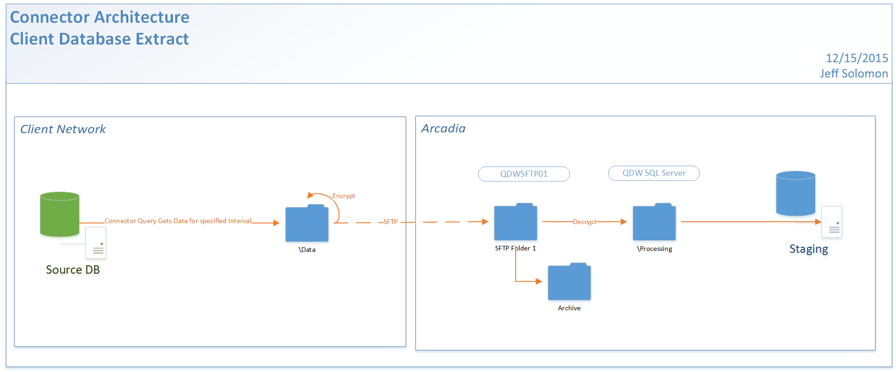
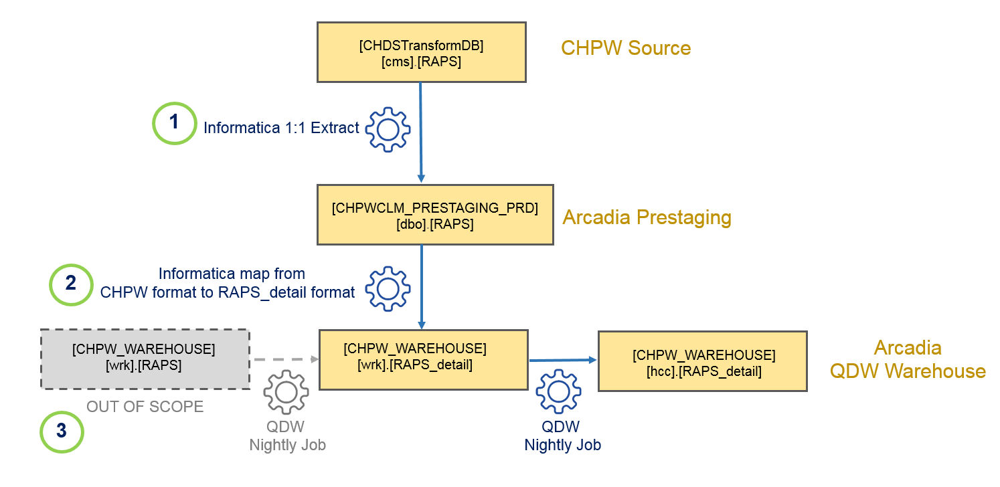

Status: Internal-Only
Author: Simon Ioffe
CreateDate: 2016-01-11
ModifyDate: 2016-01-11


#CHPWRAPS (CHPW Regulatory Affairs Professionals Society)

**Client(s)**: [CHPW](../CHPW.md)  
**Density Area**: Northwest   

## Sections:
* [Overview](#overview-and-architecture)
* [Custom Configurations](#custom-configurations)
* [Operations](#operations)
* [Data Source](#data-source)
* [Known Issues](#known-issues)
* [External Documentation Links](#external-documents)

##Overview and Architecture

| Overview ||
|-----|-----|
| Data Source Name| **CHPW Regulatory Affairs Professionals Society** |
| Data Source Acronym| **CHPWRAPS** |
| Type | **Claims** |
| Site ID | **21** |
| Architecture Model | [**Client DB Extract**](../../Tech_Delivery/Standard-Implementations/Client-DB-Extract.md)|
| Database hosting | **External** |


<a href="../../../img/Connector-Client-DB-Extract.png"></a>

###Database Connection Information  

|Database Connectivity||
|-----|-----|
|Type|MSSQL|
|Host|SEAMARTONL01|
|Port|1433|
|Name|CHDSTransformDB|
|User Name|svc_arcinfoqdw|  


###Location Hierarchy Configuration

*Not documented at this time. Contact the Solution Architect for details.*

##Custom Configurations

###Extract & Load
CHPW processed and loads in the raw RAPS file into a table format. Arcadia is be pulling the processed data directly from this table. 


<a href="../../../img/CHPW_raps.png"></a>


1. Extract data from CHPW’s source database: CHDSTransformDB.cms.RAPS and load it into Arcadia’s CHPWCLM prestaging database with minimal transportation.
2. CHPW’s RAPS table is very close to Arcadia’s wrk.RAPS_detail table. The required  transformation is applied at this step and the data is loaded into the staging synonym [staging].[RAPS_detail] which points to the warehouse table [wrk].[RAPS_detail].  
3. Out of scope, but for additional context: The standard way of loading in the RAPS file into the platform, is using the raw file and loading it into the wrk.RAPS table. For this implementation since we are not using the RAW RAPS file we are skipping this this step and load directly into the downstream RAPS_detail table.
4. For additional details on loading RAPS for CHPW please see Custom Schema Elements section of the [CHPW](../CHPW.md)  implementation page.

**Warehouse Destination**  

| wrk.RAPSDetail            |
|---------------------------|
| DetailDiagID              |
| PersonID                  |
| MemberID                  |
| HICNo                     |
| OriginalHICNo             |
| CorrectedHICNo            |
| PatientControlNo          |
| SeqNo                     |
| ProviderType              |
| FromDate                  |
| FromDateUnscrubbed        |
| ThruDate                  |
| ThruDateUnscrubbed        |
| TransactionDate           |
| TransactionDateUnscrubbed |
| DeleteInd                 |
| DiagnosisCode             |
| DiagnosisCodeUnscrubbed   |
| DiagClusterError1         |
| DiagClusterError2         |
| RiskAssessmentCode        |
| RiskAssessmentCodeError   |
| PlanNo                    |
| OverPaymentID             |
| PaymentYear               |
| FileID                    |
| ProdTestInd               |
| FileDiagType              |
| InsertTS                  |
| UpdateTS                  |
| LoadedFromFile            |
| RecordOrder               |  


  


**wrk.RapsDetail From Informatica Load Reference**

```
   [DetailDiagID]	-- Always NULL  
**	[HICNo]		  
	[OriginalHICNo]	-- Always NULL  
*	[HICErrorCode]  
*	[CorrectedHICNo]  
*	[PatientControlNo]    
*	[DOBErrorCode]  
*	[SeqNo]  
*	[SeqErrorCode]  
*	[ProviderType]  
	[FromDate]		-- Always NULL   
**	[FromDateUnscrubbed]	-- Format should be like 'YYYYMMDD'  
	[ThruDate]		-- Always NULL  
**	[ThruDateUnscrubbed]	-- Format should be like 'YYYYMMDD'  
	[TransactionDate]	-- Always NULL  
*	[TransactionDateUnscrubbed]	-- Format should be like 'YYYYMMDD'  
*	[DeleteInd]  
	[DiagnosisCode]	-- Always NULL  
**	[DiagnosisCodeUnscrubbed]  
*	[DiagClusterError1]  
*	[DiagClusterError2]  
*	[RiskAssessmentCode]  
*	[RiskAssessmentCodeError]  
*	[PlanNo]  
*	[OverPaymentID]  
*	[OverpaymentIDErrorCode]  
*	[PaymentYear]  
*	[PaymentYearErrorCode]  
*	[FileID]  
*	[ProdTestInd]  
**	[FileDiagType]  
**	[InsertTS]  
*	[UpdateTS]    
*	[LoadedFromFile]  
 	[RecordOrder]	-- Always NULL  
```  	

Note:	* 			-- Data field is not mandatory  
		** 			-- Data field is mandatory  
		(empty)		-- Data field should not be populated  
  
##Data Source

The data for this connector is pulled from [RAPS 0](../../Tech_Delivery/EHR-Documentation/RAPS.md).

##Operations
|Restriction | |
|-----|-----|
|Time of day extract/access restrictions| *Unknown. Follow up with the Solution Architect* |
|Is the database production?| *Unknown. Follow up with the Solution Architect*  |
|Frequency of Extracts| *Unknown. Follow up with the Solution Architect*  |

##Known Issues

*Not documented at this time. Contact the Solution Architect for details.*

##External Documents
- [JIRA Open Issues](https://jira.arcadiasolutions.com/issues/?jql=(labels%20%3D%20CHPWRAPS%20or%20%22Data%20Source%20Acronym%22%20~%20CHPWRAPS)%20and%20status%20!%3D%20Closed)
- [Connector Deployment History](https://github.com/arcadia/qdw/wiki/connector-version)
- Build Request (*Unknown. Follow up with the Solution Architect*)
- SOW (*Unknown. Follow up with the Solution Architect*)
