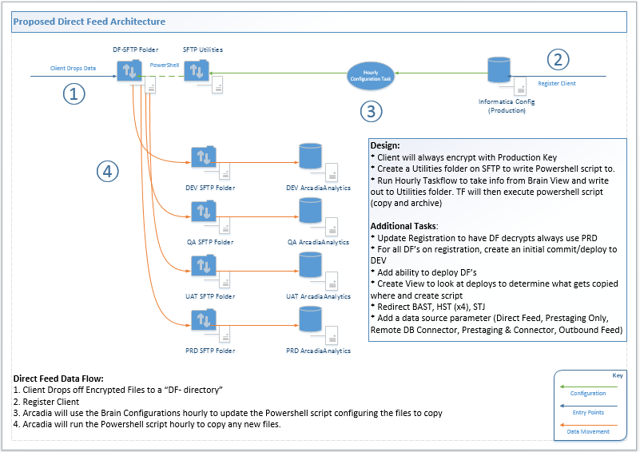

Status: Internal-Only
Author: Nick Daniel
CreateDate: 2016-06-06
ModifyDate: 2016-06-06

#FPASSOC (Family Practice Associates)

**Client(s)**: [XCLS](../XCLS.md)  
**Density Area**: New York   

## Sections:
* [Overview](#overview-and-architecture)
* [Custom Configurations](#custom-configurations)
* [Operations](#operations)
* [Data Source](#data-source)
* [Known Issues](#known-issues)
* [External Documentation Links](#external-documents)

##Overview and Architecture

| Overview ||
|-----|-----|
| Data Source Name| **Family Practice Associates** |
| Data Source Acronym| **FPASSOC** |
| Type | **Clinical** |
| Site ID | **69** |
| Architecture Model | [**Direct Feed**](../../Tech_Delivery/Standard-Implementations/Direct-Feed.md)|
| Database hosting | **Arcadia Hosted** |

###Location Hierarchy Configuration

* Crouse IPA
  * Family Practice Associates
     * Family Practice Associates
     * Family Practice Associates Unknown Location
     * Liverpool Location
     * Baldwinsville Location

##Custom Configurations

None documented at this time. 

##Data Source

Source of data is a flat file provided by the client that meets the Arcadia specifications and is loaded directly into staging.

##Operations
|Restriction | |
|-----|-----|
|Time of day extract/access restrictions| N/A, we are being sent flat files. |
|Is the database production?| Yes  |
|Frequency of Extracts| Currently extracts are not being sent on a set schedule.  |

##Known Issues

There are bad dates stored in the EHR across a handful of tables, so in order to ensure the data gets loaded instaging any such dates that are stored in an incorrect format are being replaced with '1800-01-01' prior to being sent to Arcadia.

##External Documents
- [JIRA Open Issues](https://jira.arcadiasolutions.com/issues/?jql=(labels%20%3D%20FPASSOC%20or%20%22Data%20Source%20Acronym%22%20~%20FPASSOC)%20and%20status%20!%3D%20Closed)
- [Connector Deployment History](https://github.com/arcadia/qdw/wiki/connector-version)
- [Build Request](https://arcadia.box.com/s/h4nvqvkmbe8v17c9astez3z4xmwythyx)
- [Connector Handoff](https://arcadia.box.com/s/eonamf2s9yczeo4g7jw98wp0cuo1nrkv)
- [SOW](https://arcadia.box.com/s/81vmvio34xf2brxqw8u7)
- [DQA](https://arcadia.box.com/s/ax3qi4l06hbtezto3hahh3bwnjlln4yt)