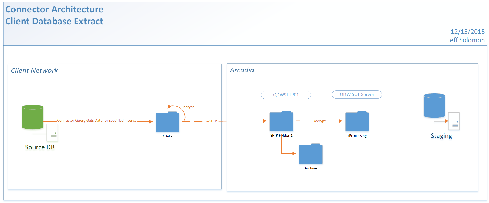

Status: Internal-Only
Author: Nick Daniel
CreateDate: 2016-01-11
ModifyDate: 2016-01-11

#LAKECON (Lake Country Family Medicine)

**Client(s)**: [AHP](../AHP.md), [XCLS](../XCLS.md)  
**Density Area**: New York   

## Sections:
* [Overview](#overview-and-architecture)
* [Custom Configurations](#custom-configurations)
* [Operations](#operations)
* [Data Source](#data-source)
* [Known Issues](#known-issues)
* [External Documentation Links](#external-documents)

##Overview and Architecture

| Overview ||
|-----|-----|
| Data Source Name| **Lake Country Family Medicine** |
| Data Source Acronym| **LAKECON** |
| Type | **Clinical** |
| Site ID | **52** |
| Architecture Model | [**Client DB Extract**](../../Tech_Delivery/Standard-Implementations/Client-DB-Extract.md)|
| Database hosting | **External** |

###Database Connection Information  

|Database Connectivity||
|-----|-----|
|Type|Toad for SQL Server|
|Host|SERVER\AMAZINGCHARTS|
|Port|61067|
|Name|AmazingCharts|
|User Name|ARCADIALOGIN|  

###Location Hierarchy Configuration

*Not documented at this time. Contact the Solution Architect for details.*

##Custom Configurations

None documented at this time. 

##Data Source

The data for this connector is pulled from [Amazing Charts 8.2.2](../../Tech_Delivery/EHR-Documentation/Amazing-Charts.md).

##Operations
|Restriction | |
|-----|-----|
|Time of day extract/access restrictions| *Unknown. Follow up with the Solution Architect* |
|Is the database production?| *Unknown. Follow up with the Solution Architect*  |
|Frequency of Extracts| *Unknown. Follow up with the Solution Architect*  |

##Known Issues

*Not documented at this time. Contact the Solution Architect for details.*

##External Documents
- [JIRA Open Issues](https://jira.arcadiasolutions.com/issues/?jql=(labels%20%3D%20LAKECON%20or%20%22Data%20Source%20Acronym%22%20~%20LAKECON)%20and%20status%20!%3D%20Closed)
- [Connector Deployment History](https://github.com/arcadia/qdw/wiki/connector-version)
- Build Request (*Unknown. Follow up with the Solution Architect*)
- SOW (*Unknown. Follow up with the Solution Architect*)