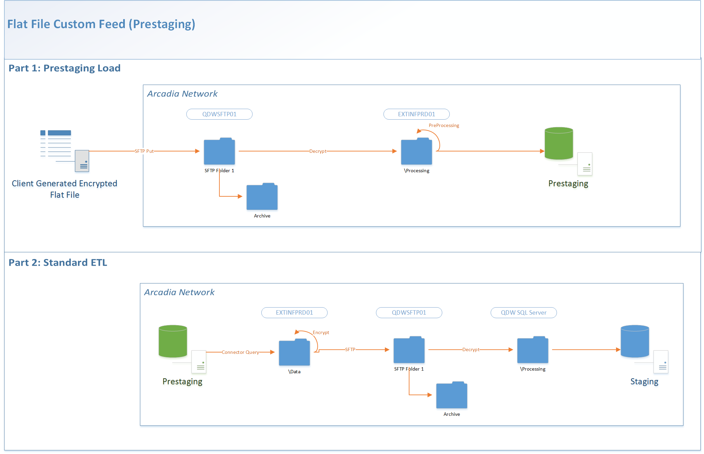

Status: Internal-Only
Author: Jeff Solomon
CreateDate: 2016-03-08
ModifyDate: 2016-03-08

#LAPATH (Louisiana PATH)

**Client(s)**: [LHCQF](../LHCQF.md)  
**Density Area**: Southeast   

## Sections:
* [Overview](#overview-and-architecture)
* [Custom Configurations](#custom-configurations)
* [Operations](#operations)
* [Data Source](#data-source)
* [Known Issues](#known-issues)
* [External Documentation Links](#external-documents)

##Overview and Architecture

| Overview ||
|-----|-----|
| Data Source Name| **Louisiana PATH** |
| Data Source Acronym| **LAPATH** |
| Type | **Clinical (ED)** |
| Site ID | **112 and 128 (Multiple sites in one feed, uses lookup table in prestaging)** |
| Architecture Model | [**Client DB Extract (Prestaging)**](../../Tech_Delivery/Standard-Implementations/Client-DB-Extract-Prestaging.md)|
| Database hosting | **Arcadia Hosted** |

###Database Connection Information  

|Database Connectivity||
|-----|-----|
|Type|MSSQL|
|Host|PRESTGSQLPRD01|
|Port|1433|
|Name|LAPATH_PRESTAGING_PRD|
|User Name|LAPATH_PRD_PRESTAGING|  

###Location Hierarchy Configuration

Nothing custom unless number of locations is very large. 

##Custom Configurations

See [onboarding process for LHCQF ED Registry connectors](./LHCQF-ED-Registry-Onboarding.md).

Should be a "copy and paste" of other ED Registry connectors. This connector is *not* subject to any LHCQF unencrypted file customizations.

###Test Patient Updates
The initial data set submitted by LAPATH contained strictly test data which by product design would not load into the warehouse, but LHCQF wanted to test the data in the UAT environment (per the onboarding process).   

To get around this, a decision was made to  

* Re-point DEV and UAT task flows to the DEV prestaging DB
* Update all patient last names from "TEST" to "Dummy123" in DEV Prestaging only (not PRD). This update allows the data to get around the nightly job test patient restrictions and be loaded in the DEV and UAT environments, while not risking loading it into production. 

##Data Source

The source of data for this connector is a flat file or set of flat files loaded into prestaging and then transformed during extract.  
These files should be loaded from the folder **\\\\qdwsftp01\0429-PR-LAPATH_SFTP_PRD**.  
Files loaded into prestaging for this source are:  

|Utilization||
|-----|-----|
| Table Name | Utilization|
| File Name Patterne | .|
| Delimiter | ,|
| Text Qualifier | "|
| Fixed Width? | False|
| Has Header? | True|
| Add Row Number? | False|  

**Columns**: FacilityName, UniversalId, MessageDateTime, PatientId, PatientDOB, PatientGender, PatientMaritalStatus, PatientStreetAddress, PatientCity, PatientState, PatientZipCode, PatientFirstName, PatientMiddleName, PatientLastName, PatientSSN, PatientPrimaryPhone, PrimaryInsuranceCompanyName, PrimaryInsuranceGroupNumber, PrimaryInsurancePolicyNumber, SecondaryInsuranceCompanyName, SecondaryInsuranceGroupNumber, SecondaryInsurancePolicyNumber, TertiaryInsuranceCompanyName, TertiaryInsuranceGroupNumber, TertiaryInsurancePolicyNumber, ChiefComplaint, VisitNumber, AdmitDateTime, AttendingPhysicianName, ReferringingPhysicianName, AdmittingingPhysicianName, DischargeDateTime, DiagnosisCode, DiagnosisText, DiagnosisCodingSystem, EmergencySeverityLevel  

##Operations
|Restriction | |
|-----|-----|
|Time of day extract/access restrictions| None |
|Is the database production?| No. Prestaging |
|Frequency of Extracts| Nightly  |

##Known Issues

*Not documented at this time.*

##External Documents
- [JIRA Open Issues](https://jira.arcadiasolutions.com/issues/?jql=(labels%20%3D%20LAPATH%20or%20%22Data%20Source%20Acronym%22%20~%20LAPATH)%20and%20status%20!%3D%20Closed)
- [Connector Deployment History](https://github.com/arcadia/qdw/wiki/connector-version)
- [Handoff Document](https://arcadia.box.com/s/apcm09t94yhnvzmcji11yurxjratiwud)
- Build Request (*Unknown. Follow up with the Solution Architect*)
- SOW (*Unknown. Follow up with the Solution Architect*)