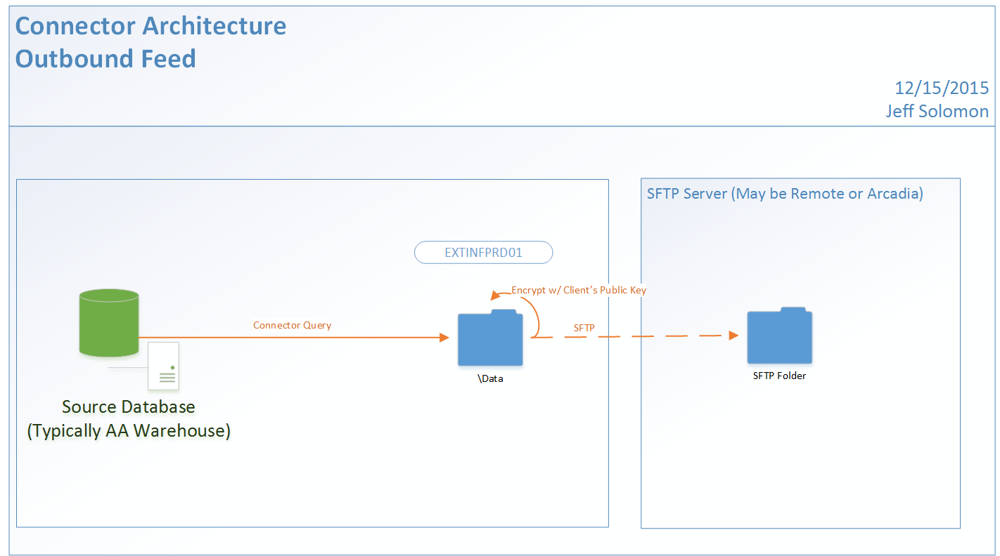

Status: Internal-Only
Author: Jeff Solomon
CreateDate: 2016-01-11
ModifyDate: 2016-01-11

#OF-STWDW (Steward Data Warehouse Feed)

**Client(s)**: [STW](../STW.md)  
**Density Area**: Northeast   

## Sections:
* [Overview](#overview-and-architecture)
* [Custom Configurations](#custom-configurations)
* [Operations](#operations)
* [Data Source](#data-source)
* [Known Issues](#known-issues)
* [External Documentation Links](#external-documents)

##Overview and Architecture

* Queries for this feed should match those of [OF-STWATHENA](./OF-STWATHENA.md).  

* We produced sample files from STW Dev a couple weeks ago, and the queries I used are at https://github.com/arcadia/connector-queries/tree/master/Extract/Custom%20Sources/TestConnector/TEST/SQL to generate the files. They are not ready to be used (and the naming convention should be changed from "StewardDemo"), but they are a good place to start.  

* CDC should be based on the warehouse updated timestamp. 

* The specs we have provided to Athena and Steward are on Box at https://arcadia.box.com/s/wbh1hxa0zg0nd1yysndi8l2rdu64cmaw

**Update 1:** Extract from t_contactinfo is removed from scope. 
**Update 2:** In later versions of this extract, we will be adding all populated plan tables and the ProgressNote table, which will be added for the HCC module.

| Overview ||
|-----|-----|
| Data Source Name| **Steward Data Warehouse Feed** |
| Data Source Acronym| **OF-STWDW** |
| Type | **** |
| Site ID | **N/A - Outbound Feed** |
| Architecture Model | [**Outbound Feed**](../../Tech_Delivery/Standard-Implementations/Outbound-Feed.md)|
| Database hosting | **Arcadia Hosted** |
| Remote SFTP Host | 198.89.66.140 |
| Remote SFTP UserName | eftarcadia03 |

Password is on lastpass. 

###Location Hierarchy Configuration

N/A - Outbound Feed. 

##Custom Configurations

N/A - Outbound Feed.

##Data Source

This is an outbound feed connector that pulls data from the Arcadia Analytics Warehouse DB's for STW.  

##Operations
|Restriction | |
|-----|-----|
|Time of day extract/access restrictions| N/A |
|Is the database production?| Yes (PRD Extract from PRD WH) |
|Frequency of Extracts| Daily Incrementals based on update timestamp |

##Known Issues

*Not documented at this time.*

##External Documents
- [JIRA Open Issues](https://jira.arcadiasolutions.com/issues/?jql=(labels%20%3D%20OF-STWDW%20or%20%22Data%20Source%20Acronym%22%20~%20OF-STWDW)%20and%20status%20!%3D%20Closed)
- [Connector Deployment History](https://github.com/arcadia/qdw/wiki/connector-version)
