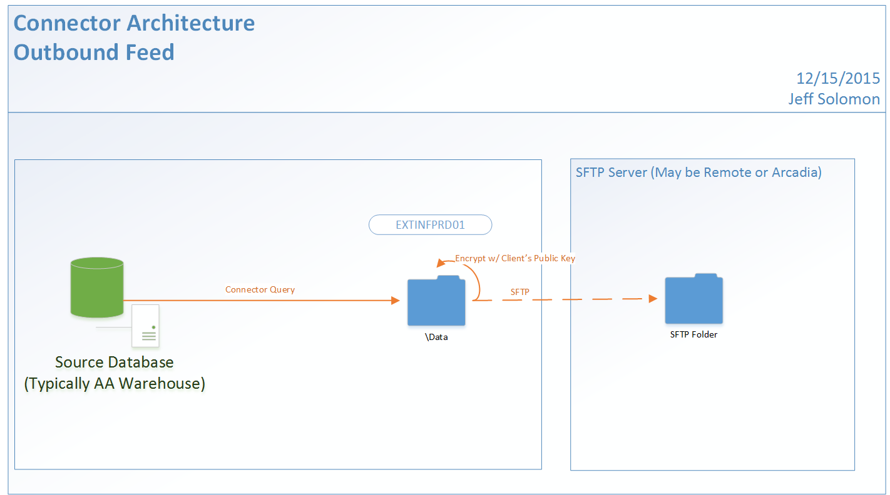

Status: Internal-Only
Author: Jeff Solomon
CreateDate: 2016-01-11
ModifyDate: 2016-01-11

#OF-STWHDS (Steward Athena)

**Client(s)**: [STW](../STW.md)  
**Density Area**: Northeast   

## Sections:
* [Overview](#overview-and-architecture)
* [Custom Configurations](#custom-configurations)
* [Operations](#operations)
* [Data Source](#data-source)
* [Known Issues](#known-issues)
* [External Documentation Links](#external-documents)

##Overview and Architecture

| Overview ||
|-----|-----|
| Data Source Name| **Steward Athena** |
| Data Source Acronym| **OF-STWHDS** |
| Type | **** |
| Site ID | **114** |
| Architecture Model | [**Outbound Feed**](../../Tech_Delivery/Standard-Implementations/Outbound-Feed.md)|
| Database hosting | **Arcadia Hosted** |

###Location Hierarchy Configuration

N/A - Outbound Feed. 

##Custom Configurations

N/A - Outbound Feed.

##Data Source

This is an outbound feed connector that pulls data from the Arcadia Analytics Warehouse DB's for STW.  

Views in warehouse all start with `v_HDS_...`, e.g. `v_HDS_Allergy`. They were all converted from stored procedures in 3.x for better compatibility with Informatica nightly extracts. 

For reference, code for 3.x procedures on [GitHub](https://github.com/arcadia/qdw-steward/tree/3.x/Database/Warehouse/Schema%20Objects/Schemas/dbo/Programmability/Stored%20Procedures)

##Operations
|Restriction | |
|-----|-----|
|Time of day extract/access restrictions| N/A |
|Is the database production?| PRD connector technically is, but no front end in use   |
|Frequency of Extracts| Daily Incrementals based on update timestamp |

##Known Issues

*Not documented at this time.*

##External Documents
- [JIRA Open Issues](https://jira.arcadiasolutions.com/issues/?jql=(labels%20%3D%20OF-STWHDS%20or%20%22Data%20Source%20Acronym%22%20~%20OF-STWHDS)%20and%20status%20!%3D%20Closed)
- [Connector Deployment History](https://github.com/arcadia/qdw/wiki/connector-version)
