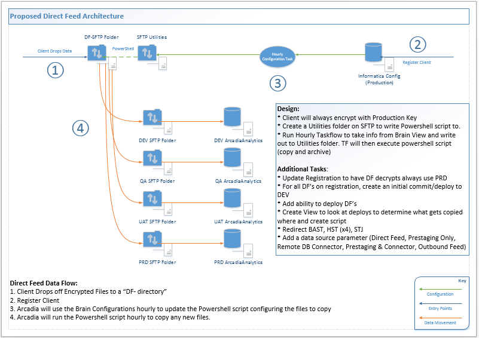

Status: Internal-Only
Author: Nick Daniel
CreateDate: 2016-01-11
ModifyDate: 2016-05-25

#PR-BAST (Bassett)

**Client(s)**: [XCLS](../XCLS.md)  
**Density Area**: New York   

## Sections:
* [Overview](#overview-and-architecture)
* [Custom Configurations](#custom-configurations)
* [Operations](#operations)
* [Data Source](#data-source)
* [Known Issues](#known-issues)
* [External Documentation Links](#external-documents)

##Overview and Architecture

| Overview ||
|-----|-----|
| Data Source Name| **Bassett** |
| Data Source Acronym| **PR-BAST** |
| Type | **Clinical** |
| Site ID | **15** |
| Architecture Model | [**Direct Feed**](../../Tech_Delivery/Standard-Implementations/Direct-Feed.md)|
| Database hosting | **Arcadia Hosted** |

###Location Hierarchy Configuration

* Bassett
     * Bassett - Unknown Location
     * BASSETT HEALTHCARE NETWORK
     * BASSETT MEDICAL CENTER LOCATION (MIB)
     * BASSETT MEDICAL CENTER SERVICE AREA (MIB)
     * COBLESKILL REGIONAL HOSPITAL LOCATION (CRH)
     * LITTLE FALLS HOSPITAL LOCATION (LFH)
     * O'CONNOR HOSPITAL LOCATION (OCO)
     * TRI-TOWN REGIONAL HOSPITAL LOCATION (TRH)
     * BHC ANDES HC
     * BHC CANAJOHARIE HC
     * BHC CHERRY VALLEY HC
     * BHC CLINTON HC
     * BHC COBLESKILL HC
     * BHC DELANSON HC
     * BHC DELHI HEALTH CTR
     * BHC EDMESTON HC
     * BHC HAMILTON HC
     * BHC HERKIMER HC
     * BHC LF PRIME CARE
     * BHC MIDDLEBURGH HC
     * BHC MORRIS HC
     * BHC NORWICH HC
     * BHC ONEONTA FAMILY MED
     * BHC ONEONTA HC
     * BHC ONEONTA PEDS
     * BHC RICH SPRINGS HC
     * BHC SCHOHARIE CLINIC
     * BHC SHARON SPRINGS HC
     * BHC SHERBURNE HC
     * BHC SIDNEY PRIME CARE
     * BHC ST JOHNSVILLE HC
     * BHC STAMFORD HC
     * BHC UNADILLA HC
     * BHC WALTON HC
     * BHC WEST WINFIELD HC
     * COB PSYCH CLINIC
     * CRH CARDIOLOGY CLINIC
     * CRH CLINICAL NUTRITION
     * CRH EMERGENCY DEPT
     * CRH ENT CLINIC
     * CRH GEN SURGERY
     * CRH OPHTH CLINIC
     * CRH ORTHOPEDIC CLINIC
     * CRH OT
     * CRH PHYSICAL THERAPY
     * CRH PULMONARY CLINIC
     * CRH SPEECH THERAPY
     * CRH UROLOGY
     * CRH VASCULAR SURGERY
     * CRH WOMENS HEALTH
     * DEL CLINICAL NUTRITION
     * FOX MED ONC
     * FOX RAD ONC
     * FOXCARE CARDIOLOGY CLINIC
     * FOXCARE ORTHOPEDIC CLINIC
     * FOXCARE PHYSIATRY
     * HERKIMER CONV CARE
     * HHC CARDIAC SURGERY
     * HHC CARDIOLOGY CLINIC
     * HHC DIGESTIVE DISEASE
     * HHC ENDOCRINOLOGY
     * HHC MED ONC
     * HHC NEPHROLOGY
     * HHC OPHTH CLINIC
     * HHC ORTHOPEDIC CLINIC
     * HHC PEDIATRICS
     * HHC PROCEDURES
     * HHC RHEUMATOLOGY
     * HHC UROLOGY
     * HSD DERMATOLOGY
     * HSD PHYSIATRY
     * HSD PLASTIC SURGERY
     * HSS GEN SURGERY
     * LFH AMB SURG UNIT
     * LFH DOLGEVILLE EXPRESS
     * LFH DOLGEVILLE HC
     * LFH EMERGENCY DEPT
     * LFH HOSPITALISTS
     * LFH NEWPORT HC
     * LFH OT
     * LFH PHYSICAL THERAPY
     * LFH PREOP H&P
     * LSS CARDIOLOGY CLINIC
     * LSS ENT CLINIC
     * LSS GEN SURGERY
     * LSS UROLOGY
     * MIB ALLERGY
     * MIB ANES - CRNA'S
     * MIB AUDIOLOGY
     * MIB CARDIAC CATH LAB
     * MIB CARDIAC SURGERY
     * MIB CARDIOLOGY CLINIC
     * MIB CLINICAL NUTRITION
     * MIB COAGULATION CLINIC
     * MIB DIGESTIVE DISEASE
     * MIB EMERGENCY DEPT
     * MIB EMPLOYEE HEALTH
     * MIB ENDOCRINOLOGY
     * MIB ENT CLINIC
     * MIB GEN SURGERY
     * MIB GI LAB
     * MIB HOSPITALISTS
     * MIB ICU INP
     * MIB INFECTIOUS DISEASE
     * MIB LABORATORY
     * MIB MED ONC (CTC)
     * MIB MEDICINE INP
     * MIB MOBILE MAMMO
     * MIB NEPHROLOGY
     * MIB NEUROLOGY
     * MIB NEUROSURGERY
     * MIB OBSTETRIC INP
     * MIB OPHTH CLINIC
     * MIB ORTHOPEDIC CLINIC
     * MIB OT
     * MIB PALLIATIVE CARE
     * MIB PED CARD (PCL)
     * MIB PEDIATRIC CLINIC
     * MIB PHYSICAL THERAPY
     * MIB PLASTIC SURGERY
     * MIB PREOP H&P
     * MIB PRIME CARE CLINIC
     * MIB PSYCH CLINIC
     * MIB PSYCH INP
     * MIB PULM LAB
     * MIB PULMONOLOGY
     * MIB RAD ONC
     * MIB RADIOLOGY
     * MIB RHEUMATOLOGY
     * MIB SOCIAL WORK
     * MIB SPEECH LANG PATH
     * MIB UROLOGY
     * MIB VASCULAR SURGERY
     * MIB WOMENS HEALTH
     * NOR PSYCH CLINIC
     * OCH DIETARY
     * OCH EMERGENCY DEPT
     * OCH GEN SURGERY DUPLICATE
     * OCH HOSPITALISTS
     * OCH OT
     * OCH PHYSICAL THERAPY
     * OCH PODIATRY CLINIC
     * OCH SOCIAL SERVICES
     * OCH SPEECH THERAPY
     * ONEONTA CONV CARE
     * ONEONTA WOMEN'S HEALTH
     * OSA GEN SURGERY
     * OSS DERMATOLOGY
     * OSS ENT CLINIC
     * OSS GEN SURGERY
     * OSS GI LAB
     * OSS OPHTH CLINIC
     * OSS ORTHOPEDIC CLINIC
     * OSS PHYSICAL THERAPY
     * OSS PLASTIC SURGERY
     * OSS PREOP H&P
     * OUC UROLOGY
     * RRA PHYSICAL THERAPY
     * SBH COOPERSTOWN M-H
     * SBH DASH ELEMENTARY
     * SBH EDMESTON
     * SBH LAURENS
     * SBH MIDDLEBURGH
     * SBH MILFORD
     * SBH MORRIS
     * SBH SCHENEVUS
     * SBH SHER-EARLVILLE ELE
     * SBH SHER-EARLVILLE M-H
     * SBH SIDNEY ELEM-MID
     * SBH SIDNEY HIGH
     * SBH SOUTH KORTRIGHT
     * SBH STAMFORD
     * SBH UNADILLA VALLEY
     * SBH WORCESTER
     * TRH EMERGENCY DEPT
     * SBH GMU ELEMENTARY
     * NOR VASCULAR SURGERY
     * MIB NEUROSCIENCE
     * CRH RHEUMATOLOGY CLN
     * OCO DEXASCAN
     * HHC GEN SURGERY
     * HSD NEUROSURGERY
     * MIB CLINIC CONF RM 1
     * CRH VASCULAR LAB
     * LFH CARDIOLOGY
     * TRH PLASTIC SURGERY
     * ONT ENDOCRINOLOGY
     * HSS UROLOGY
     * OCH WOMENS HEALTH
     * HHC PREOP H&P
     * HHC ENT CLINIC
     * CRH ENDOCRINOLOGY
     * MIB PULMONARY REHAB
     * HSS VASCULAR SURGERY
     * STJ DIAB MGMT CLINIC
     * OSS RADIOLOGY
     * CAN OB&GYN CLINIC
     * HSD WOUND CARE CENTER
     * TRH RADIOLOGY
     * CRH MEDICAL IMAGING
     * CRH SURGICAL CLINIC
     * SBH RICHFIELD SPRINGS
     * HHC DIAB MGMT CLINIC
     * OSS PHYSIATRY
     * HSS CARDIOLOGY CLINIC
     * OSS NEUROLOGY
     * HHC PULMONARY
     * OCH OPHTH CLINIC
     * CRH PLASTIC SURGERY
     * LFH PULMONARY LAB
     * OCH ORTHOPEDIC CLINIC
     * SBH UNADILLA ELEM
     * HHC PSYCH CLINIC
     * LSS NEUROSURGERY
     * UNA DIAB MGMT CLINIC
     * CRH NEPHROLOGY
     * NOR ENDOCRINOLOGY
     * OCH PULMONARY CLINIC
     * CLI DIAB MGMT CLINIC
     * CRH PREOP H&P
     * OCH ENDOCRINOLOGY
     * MIB CARDIAC REHAB
     * HAM DIAB MGMT CLINIC
     * OSS NEUROSURGERY
     * LFH DIAB MGMT CLINIC
     * BHC HAMILTON PLAS SURG
     * HHC CLINICAL NUTRITION
     * CRH PHYSIATRY
     * MIB DIAB MGMT CLINIC
     * HSS ULTRASOUND
     * OSS PSYCH CLINIC
     * BHC HAMILTON DENTAL
     * FOX HOSPITAL BREAST CLINIC
     * HSS PLASTIC SURGERY
     * OSS PULMONARY CLINIC
     * HHC PLASTIC SURGERY
     * TRH PREOP H&P
     * MIB AMB SURGERY
     * TRH MED ONC
     * OSS NEPHROLOGY
     * CRH GASTROENTEROLOGY
     * LSS ORTHOPEDIC CLINIC
     * OSS UROLOGY
     * HSS ENT CLINIC
     * HHC PHYSIATRY
     * MIB MED CLINIC
     * HSS CLINICAL NUTRITION
     * SBH RIVERSIDE ELEMENT
     * HHC VASCULAR SURGERY
     * OSS DIGESTIVE DISEASE
     * LSS PLASTIC SURGERY
     * PATHFINDER VILLAGE
     * TRH GEN SURGERY
     * CRH RESP THERAPY
     * VHS REHAB
     * OCH PLASTIC SURGERY
     * CRH NEUROSURGERY
     * FOXCARE COAGULATION CL
     * CRH NEUROLOGY CLINIC
     * TRH UROLOGY
     * HSD VASCULAR SURGERY
     * MIB IP CARDIO VAS UNIT
     * SBH CV-S ELEM/MIDDLE
     * LSS VASCULAR SURGERY
     * FOXCARE PLASTIC SURG
     * RRA PHYSIATRY
     * CRH DERMATOLOGY
     * COB DIAB MGMT CLINIC
     * WAL DIAB MGMT CLINIC
     * SPRINGBROOK
     * HHC NEUROSURGERY
     * SBH DASH MIDDLE-HIGH
     * OCH CARDIOLOGY CLINIC
     * HHC RAD ONC
     * NOR RHEUMATOLOGY
     * HHC GI LAB
     * HSS WOMENS HEALTH CLINIC
     * OCH PREOP H&P
     * VALLEY HEALTH SERVICES
     * HSS PSYCH CLINIC
     * LFH RADIOLOGY
     * CAN DIAB MGMT CLINIC
     * SBH OTEGO ELEMENTARY
     * SBH MIDDLEBURGH M-H
     * VHS CARDIAC REHAB
     * LSS INFECTIOUS DISEASE
     * ONT PSYCH CLINIC
     * THE PLAINS AT PARISH HOMESTEAD
     * HHC RADIOLOGY
     * OSS SPECIALTY SERVICES
     * HSS PREOP H&P
     * TRH VASCULAR SURGERY
     * TRH ORTHOPEDICS
     * MIB RADIOLOGY T2
     * DFM DIAB MGMT CLINIC
     * FOXCARE PED CARDIOLOGY
     * OCH RADIOLOGY
     * CRH ONCOLOGY CLINIC
     * ONT DIAB MGMT CLINIC
     * CRH DIAB MGMT CLINIC
     * NOR NEPHROLOGY
     * OCH VASCULAR SURGERY
     * OCH UROLOGY
     * BHC DELHI DENTAL
     * HHC NEUROLOGY
     * MIB DERMATOLOGY
     * OSS VASCULAR SURGERY
     * HHC WOMENS HEALTH
     * ONT CLINICAL NUTRITION
     * OSS PROCEDURES
     * OSS ENDOCRINOLOGY
     * SBH COOPERSTOWN ELEM

##Custom Configurations

None documented at this time. 

##Data Source

Source of data is a flat file provided by the client that meets the Arcadia specifications and is loaded directly into staging.

##Operations
|Restriction | |
|-----|-----|
|Time of day extract/access restrictions| Not applicable as the client provides the files |
|Is the database production?| Yes |
|Frequency of Extracts| Weekly |

##Known Issues

*Not documented at this time. Contact the Solution Architect for details.*

##External Documents
- [JIRA Open Issues](https://jira.arcadiasolutions.com/issues/?jql=(labels%20%3D%20PR-BAST%20or%20%22Data%20Source%20Acronym%22%20~%20PR-BAST)%20and%20status%20!%3D%20Closed)
- [Connector Deployment History](https://github.com/arcadia/qdw/wiki/connector-version)
- [Build Request](https://arcadia.box.com/s/7uoi4pv5xt44pn75ajlbmgc29z5zh5up)
- [SOW](https://arcadia.box.com/s/81vmvio34xf2brxqw8u7)