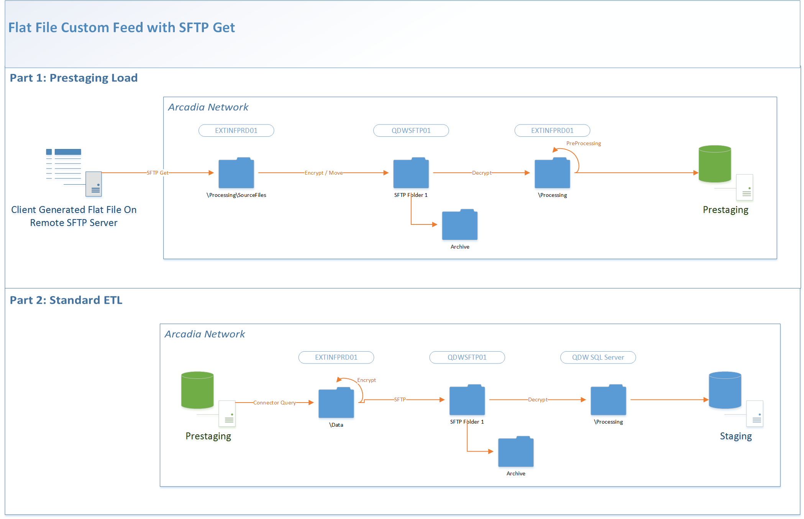

Status: Internal-Only
Author: Jeff Solomon
CreateDate: 2016-03-31
ModifyDate: 2016-05-26

#WCHNATHENA (Western Connecticut Health Network- Athena)

**Client(s)**: [WCHN](../WCHN.md)  
**Density Area**: Northeast   

## Sections:
* [Overview](#overview-and-architecture)
* [Custom Configurations](#custom-configurations)
* [Operations](#operations)
* [Data Source](#data-source)
* [Known Issues](#known-issues)
* [External Documentation Links](#external-documents)

##Overview and Architecture

| Overview ||
|-----|-----|
| Data Source Name| **Western Connecticut Health Network- Athena** |
| Data Source Acronym| **WCHNATHENA** |
| Type | **Clinical** |
| Site ID | **37** |
| Architecture Model | [**Client DB Extract (Prestaging w/ SFTP Get)**](../../Tech_Delivery/Standard-Implementations/Client-DB-Extract-Prestaging-SFTP-Get.md)|
| Database hosting | **Arcadia Hosted** |

###Database Connection Information  

|Database Connectivity||
|-----|-----|
|Type|MSSQL|
|Host|PRESTGSQLPRD01|
|Port|1433|
|Name|WCHNATHENA_PRESTAGING_PRD|
|User Name|WCHNATHENA_PRD_PRESTAGING|  
 
Files are pulled from WCHN's SFTP Server:  
**Path:** /EMRClaims/dailies/Athena  
**Host:** Secure.wchn.org  
**User:** zArcadia  
**Port:** 22  
Password is on LastPass.   

###Location Hierarchy Configuration

No custom requirements at this time. Should be under a WCHN parent location in VCA environment. 

##Custom Configurations

Uses SFTP Get. The files pulled from the SFTP server are zipped, so must use the Unzip_NewFiles task.  This can be created using the connector studio.

The diagram above, a customization of the standard prestaging data flow diagram, represents the architecture.  

##Data Source

The source of data for this connector is a set of flat files (*Athena Data Warehouse Feed*) loaded into prestaging and then transformed during extract.   

**NOTE 1** The data warehouse feed broke on WCHN's end, so until that is fixed the *most recent data available will be from 3/3/2016*.  

**NOTE 2** Athena is used by WCHN as a Practice Management (PM) tool as opposed to a full EHR. As a result, the only available data for us to map are appointments, encounters, assessments, charges, patients, providers, and payers.  All other tables will not be populated for this connector as the providers do not use it do capture clinical data during an encounter.  A few other customizations must be made to accomodate the particular setup of Athena at WCHN:   

* *t_assessment* - Map from the ClaimDiagnosis table as opposed to the standard place for clinically recorded assessments in Athena DW feed.  These are the Dx codes associated with claims, and product has confirmed that this is the appropriate way to handle this situation.  
* *t_encounter* - Because there are no true "encounters" recorded in the PM tool, we must use charges (transactions table in the DW feed) as the base for our encounter query.   This will allow for appropriate linkages between encounters and claims and also to calculate medical encounters for the patients in this source using the standard set of CPT codes.  This table can also be joined to the appointment table, which can be used to gather additional information about the encounters. 

##Operations
|Restriction | |
|-----|-----|
|Time of day extract/access restrictions| None |
|Is the database production?| No, Prestaging.  |
|Frequency of Extracts| Daily |

##Known Issues

See Note 1 above. 

##External Documents
- [JIRA Open Issues](https://jira.arcadiasolutions.com/issues/?jql=(labels%20%3D%20WCHNATHENA%20or%20%22Data%20Source%20Acronym%22%20~%20WCHNATHENA)%20and%20status%20!%3D%20Closed)
- [Connector Deployment History](https://github.com/arcadia/qdw/wiki/connector-version)
- Build Request (*Unknown. Follow up with the Solution Architect*)
- SOW (*Unknown. Follow up with the Solution Architect*)