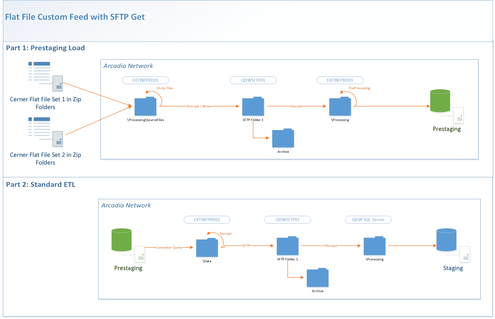

Status: Internal-Only
Author: Jeff Solomon
CreateDate: 2016-01-11
ModifyDate: 2016-02-23

#WCHNCERN (Western Connecticut Health Network- Cerner)

**Client(s)**: [WCHN](../WCHN.md)  
**Density Area**: Northeast   

## Sections:
* [Overview](#overview-and-architecture)
* [Custom Configurations](#custom-configurations)
* [Operations](#operations)
* [Data Source](#data-source)
* [Known Issues](#known-issues)
* [External Documentation Links](#external-documents)

##Overview and Architecture

| Overview ||
|-----|-----|
| Data Source Name| **Western Connecticut Health Network- Cerner** |
| Data Source Acronym| **WCHNCERN** |
| Type | **Clinical** |
| Site ID | **4** |
| Architecture Model | [**Client DB Extract (Prestaging w/ SFTP Get) with customizations**](../../Tech_Delivery/Standard-Implementations/Client-DB-Extract-Prestaging-SFTP-Get.md)|
| Database hosting | **Arcadia Hosted** |

Files are pulled from WCHN's SFTP Server:  
**Path:** /EMRClaims/dailies/Cerner  
**Host:** Secure.wchn.org  
**User:** zArcadia  
**Port:** 22  
Password is on LastPass.   

###Database Connection Information  

|Database Connectivity||
|-----|-----|
|Type|MSSQL|
|Host|PRESTGSQLPRD01|
|Port|1433|
|Name|WCHNCERN_PRESTAGING_PRD|
|User Name|WCHNCERN_PRD_PRESTAGING|  

###Location Hierarchy Configuration

No custom requirements. Should be under a WCHN parent location.

##Custom Configurations

The prestaging load for this source contains custom steps for a few reasons.  
  
1. We are picking up files from a remote SFTP server hosted by WCHN. This would not be custom except for (2) and (3).

3. The files we are pulling from the SFTP server are combined into ZIP folders, so we need to run a task called "UnzipSourceFiles". This calls a batch script (UnzipFiles.bat) that delete all non-zip files in the SourceFiles folder, unzips all zip folders using 7-Zip, and then deletes the .zip files. If for any reason it becomes necessary to re-create the task, it can be done by:  
* Generating the API caller script for the "Delete_NewUnencryptedFiles" task on the task tab of connector studio
* Updating the CMD parameter to point to UnzipFiles.bat, the name of the task, and the log file. 
* Running that script through the API caller. 

The diagram above, a customization of the standard prestaging data flow diagram, represents the architecture.  

##Data Source

The source of data for this connector is a flat file or set of flat files loaded into prestaging and then transformed during extract.  
These files should be loaded from the folder **\\\\qdwsftp01\0317-PR-WCHNCERN_SFTP_PRD**.  

Previous implementations for this extract (UCF) use tables from both EMR and CPM (Cerner Practice Manager) systems, but this site only uses the EMR. 

As a result, a new set of queries (EMR) were developed for use here. 

Files loaded into prestaging for this source are:  

|cpm_insurance||
|-----|-----|
| Table Name | cpm_insurance|
| File Name Pattern | cpm*_insurance.|
| Delimiter | ||
| Text Qualifier | "|
| Fixed Width? | False|
| Has Header? | True|
| Add Row Number? | False|  

**Columns**: ENTITY_IDENTIFIER, ENTITY_TYPE, UNIQUE_HEALTH_PLAN_IDENITIFER, GROUP_NAME, GROUP_NUMBER, MEMBER_NUMBER, POLICY_NUMBER, PRIORITY, ENTITY_TO_SUBSCRIBER_RELATIONSHIP, SUBSCRIBER_TO_ENTITY_RELATIONSHIP, SUBSCRIBER_IDENTIFIER, ORGANIZATION_IDENTIFIER, STATUS, EFFECTIVE_BEGIN_DATE_TIME, EFFECTIVE_END_DATE_TIME, UPDATE_DATE_TIME  

|cpm_person||
|-----|-----|
| Table Name | cpm_person|
| File Name Pattern | cpm*_person.|
| Delimiter | ||
| Text Qualifier | "|
| Fixed Width? | False|
| Has Header? | True|
| Add Row Number? | False|  

**Columns**: UNIQUE_PERSON_IDENTIFIER, LAST_NAME, FIRST_NAME, MIDDLE_NAME, GENDER, DATE_OF_BIRTH, DECEASED, DECEASED_DATE, VIP, LANGUAGE, MARITAL_STATUS, RACE, ETHNICITY, RELIGION, NATIONALITY, HOME_PHONE, BUSINESS_PHONE, MOBILE_PHONE, HOME_ADDRESS, BUSINESS_ADDRESS, EMAIL_ADDRESS, IDENTIFIERS, EFFECTIVE_BEGIN_DATE_TIME, EFFECTIVE_END_DATE_TIME, UPDATE_DATE_TIME, STATUS, ACTIVE_STATUS_DATE_TIME  

|cpm_personnelreltn||
|-----|-----|
| Table Name | cpm_personnelreltn|
| File Name Pattern | cpm*_personnelreltn.|
| Delimiter | ||
| Text Qualifier | "|
| Fixed Width? | False|
| Has Header? | True|
| Add Row Number? | False|  

**Columns**: UNIQUE_PERSONNEL_IDENTIFIER, RELATIONSHIP_TYPE, ENTITY_TYPE, ENTITY_IDENTIFIER, EFFECTIVE_BEGIN_DATE_TIME, EFFECTIVE_END_DATE_TIME, UPDATE_DATE_TIME, STATUS, ACTIVE_STATUS_DATE_TIME, EXPIRE_DATE_TIME  

|cpm_refcode||
|-----|-----|
| Table Name | cpm_refcode|
| File Name Pattern | cpm*_refcode.|
| Delimiter | ||
| Text Qualifier | "|
| Fixed Width? | False|
| Has Header? | True|
| Add Row Number? | False|  

**Columns**: FILE_NAME, FIELD, COMPONENT, ELEMENT_CODE, DISPLAY, DESCRIPTION, TYPE  

|cpm_refhealthplans||
|-----|-----|
| Table Name | cpm_refhealthplans|
| File Name Pattern | cpm*_refhealthplans.|
| Delimiter | ||
| Text Qualifier | "|
| Fixed Width? | False|
| Has Header? | True|
| Add Row Number? | False|  

**Columns**: UNIQUE_HEALTH_PLAN_IDENITIFER, PLAN_NAME, PLAN_DESCRIPTION, FINANCIAL_CLASS, PLAN_CLASS, PLAN_TYPE, BUSINESS_ADDRESS, BUSINESS_PHONE, IDENTIFIERS, EFFECTIVE_BEGIN_DATE_TIME, EFFECTIVE_END_DATE_TIME, UPDATE_DATE_TIME, STATUS, ACTIVE_STATUS_DATE_TIME  

|cpm_reflocations||
|-----|-----|
| Table Name | cpm_reflocations|
| File Name Pattern | cpm*_reflocations.|
| Delimiter | ||
| Text Qualifier | "|
| Fixed Width? | False|
| Has Header? | True|
| Add Row Number? | False|  

**Columns**: ENTITY_IDENTIFIER, ENTITY_REFERENCE_TYPE, TYPE, NAME, ORGANIZATION_IDENTIFIER, BUSINESS_ADDRESS, BUSINESS_PHONE, EFFECTIVE_BEGIN_DATE_TIME, EFFECTIVE_END_DATE_TIME, UPDATE_DATE_TIME, STATUS, ACTIVE_STATUS_DATE_TIME  

|cpm_refpersonnel||
|-----|-----|
| Table Name | cpm_refpersonnel|
| File Name Pattern | cpm*_refpersonnel.|
| Delimiter | ||
| Text Qualifier | "|
| Fixed Width? | False|
| Has Header? | True|
| Add Row Number? | False|  

**Columns**: ENTITY_IDENTIFIER, PHYSICIAN, LAST_NAME, FIRST_NAME, MIDDLE_NAME, GENDER, POSITION, IDENTIFIERS, EFFECTIVE_BEGIN_DATE_TIME, EFFECTIVE_END_DATE_TIME, UPDATE_DATE_TIME, STATUS, ACTIVE_STATUS_DATE_TIME  

|cpm_revcomment||
|-----|-----|
| Table Name | cpm_revcomment|
| File Name Pattern | cpm*_revcomment.|
| Delimiter | ||
| Text Qualifier | "|
| Fixed Width? | False|
| Has Header? | True|
| Add Row Number? | False|  

**Columns**: UNIQUE_COMMENT_IDENTIFIER, UNIQUE_ACCOUNT_IDENTIFIER, UNIQUE_REVENUE_VISIT_IDENTIFIER, CREATED_BY, PARENT_ENTITY_IDENTIFIER, PARENT_ENTITY_NAME, TEXT, EFFECTIVE_BEGIN_DATE_TIME, EFFECTIVE_END_DATE_TIME, UPDATE_DATE_TIME  

|cpm_revvisit||
|-----|-----|
| Table Name | cpm_revvisit|
| File Name Pattern | cpm*_revvisit.|
| Delimiter | ||
| Text Qualifier | "|
| Fixed Width? | False|
| Has Header? | True|
| Add Row Number? | False|  

**Columns**: UNIQUE_REVENUE_VISIT_IDENTIFIER, UNIQUE_VISIT_IDENTIFIER, UNIQUE_ACCOUNT_IDENTIFIER, BILLING_ENTITY_IDENTIFIER, FINANCIAL_CLASS, BALANCE, BALANCE_TYPE, BAD_DEBT_BALANCE, BAD_DEBT_BALANCE_TYPE, BAD_DEBT_DATE_TIME, ZERO_BALANCE_DATE_TIME, COMBINED_INTO_UNIQUE_REVENUE_VISIT_IDENTIFIER, EFFECTIVE_BEGIN_DATE_TIME, EFFECTIVE_END_DATE_TIME, UPDATE_DATE_TIME, STATUS, ACTIVE_STATUS_DATE_TIME  

|cpm_schedule||
|-----|-----|
| Table Name | cpm_schedule|
| File Name Pattern | cpm*_schedule.|
| Delimiter | ||
| Text Qualifier | "|
| Fixed Width? | False|
| Has Header? | True|
| Add Row Number? | False|  

**Columns**: UNIQUE_SCHEDULE_IDENTIFIER, UNIQUE_PERSON_IDENTIFIER, UNIQUE_VISIT_IDENTIFIER, TYPE, STATE, REASON, LOCATION, START_DATE_TIME, END_DATE_TIME, DURATION, APPOINTMENT_REQUEST_DATE_TIME, REQUESTED_START_DATE_TIME, REQUESTED_END_DATE_TIME, REQUESTED_PRIORITY, IDENTIFIERS, EFFECTIVE_BEGIN_DATE_TIME, EFFECTIVE_END_DATE_TIME, UPDATE_DATE_TIME, STATUS, ACTIVE_STATUS_DATE_TIME  

|cpm_scheduleaction||
|-----|-----|
| Table Name | cpm_scheduleaction|
| File Name Pattern | cpm*_scheduleaction.|
| Delimiter | ||
| Text Qualifier | "|
| Fixed Width? | False|
| Has Header? | True|
| Add Row Number? | False|  

**Columns**: UNIQUE_SCHEDULE_IDENTIFIER, UNIQUE_SCHEDULE_ACTION_IDENTIFIER, ACTION_DATE_TIME, ACTION, ACTION_REASON, ACTION_BY, EFFECTIVE_BEGIN_DATE_TIME, EFFECTIVE_END_DATE_TIME, UPDATE_DATE_TIME, STATUS, ACTIVE_STATUS_DATE_TIME  

|cpm_scheduleresource||
|-----|-----|
| Table Name | cpm_scheduleresource|
| File Name Pattern | cpm*_scheduleresource.|
| Delimiter | ||
| Text Qualifier | "|
| Fixed Width? | False|
| Has Header? | True|
| Add Row Number? | False|  

**Columns**: UNIQUE_SCHEDULE_IDENTIFIER, SCHEDULED_RESOURCE, RESOURCE_DESCRIPTION, RESOURCE_TYPE, UNIQUE_RESOURCE_PERSONNEL_IDENTIFIER, PRIMARY_APPOINTMENT_RESOURCE, EFFECTIVE_BEGIN_DATE_TIME, EFFECTIVE_END_DATE_TIME, UPDATE_DATE_TIME, STATUS, ACTIVE_STATUS_DATE_TIME  

|cpm_visit||
|-----|-----|
| Table Name | cpm_visit|
| File Name Pattern | cpm*_visit.|
| Delimiter | ||
| Text Qualifier | "|
| Fixed Width? | False|
| Has Header? | True|
| Add Row Number? | False|  

**Columns**: UNIQUE_VISIT_IDENTIFIER, UNIQUE_PERSON_IDENTIFIER, VISIT_TYPE_CLASS, REGISTRATION_DATE_TIME, DISCHARGE_DATE_TIME, LOCATION, PLACE_OF_SERVICE, ORGANIZATION_IDENTIFIER, IDENTIFIERS, EFFECTIVE_BEGIN_DATE_TIME, EFFECTIVE_END_DATE_TIME, UPDATE_DATE_TIME, STATUS, ACTIVE_STATUS_DATE_TIME  

|emr_address||
|-----|-----|
| Table Name | emr_address|
| File Name Pattern | _address.|
| Delimiter | ||
| Text Qualifier | "|
| Fixed Width? | False|
| Has Header? | True|
| Add Row Number? | False|  

**Columns**: RECORD_IDENTIFIER, TYPE, SEQUENCE, ENTITY_IDENTIFIER, ENTITY_TYPE, ADDRESS_LINE_1, ADDRESS_LINE_2, ADDRESS_LINE_3, ADDRESS_LINE_4, CITY_TEXT, CITY_CODE, STATE_TEXT, STATE_CODE, ZIPCODE, ZIPCODE_KEY, COUNTRY_TEXT, COUNTRY_CODE, COUNTY_TEXT, COUNTY_CODE, ACTIVE, ACTIVE_STATUS_DATE_TIME, EFFECTIVE_BEGIN_DATE_TIME, EFFECTIVE_END_DATE_TIME, UPDATE_DATE_TIME  

|emr_allergy||
|-----|-----|
| Table Name | emr_allergy|
| File Name Pattern | _allergy.|
| Delimiter | ||
| Text Qualifier | "|
| Fixed Width? | False|
| Has Header? | True|
| Add Row Number? | False|  

**Columns**: RECORD_IDENTIFIER, UNIQUE_ALLERGY_IDENTIFIER, UNIQUE_PERSON_IDENTIFIER, UNIQUE_VISIT_IDENTIFIER, ALLERGY_TERMINOLOGY_IDENTIFIER, ALLERGY_TYPE, ENTERED_BY, ONSET_DATE_TIME, ONSET_DATE_PRECISION, ONSET_DATE_PRECISION_CODE, REACTION_CLASS, REACTION_STATUS, REACTION_STATUS_DATE_TIME, REVIEWED_BY, REVIEWED_DATE_TIME, SEVERITY, INFORMATION_SOURCE_CODE, INFORMATION_SOURCE_FREETEXT, CANCEL_DATE_TIME, CANCEL_REASON, CANCEL_BY, ACTIVE, ACTIVE_STATUS_DATE_TIME, EFFECTIVE_BEGIN_DATE_TIME, EFFECTIVE_END_DATE_TIME, UPDATE_DATE_TIME  

|emr_allergyreaction||
|-----|-----|
| Table Name | emr_allergyreaction|
| File Name Pattern | _allergyreaction.|
| Delimiter | ||
| Text Qualifier | "|
| Fixed Width? | False|
| Has Header? | True|
| Add Row Number? | False|  

**Columns**: RECORD_IDENTIFIER, UNIQUE_ALLERGY_IDENTIFIER, UNIQUE_ALLERGY_INSTANCE_IDENTIFIER, REACTION_TERMINOLOGY_IDENTIFIER, REACTION_DESCRIPTION_FREETEXT, ACTIVE, ACTIVE_STATUS_DATE_TIME, EFFECTIVE_BEGIN_DATE_TIME, EFFECTIVE_END_DATE_TIME, UPDATE_DATE_TIME  

|emr_allergyreview||
|-----|-----|
| Table Name | emr_allergyreview|
| File Name Pattern | _allergyreview.|
| Delimiter | ||
| Text Qualifier | "|
| Fixed Width? | False|
| Has Header? | True|
| Add Row Number? | False|  

**Columns**: RECORD_IDENTIFIER, UNIQUE_ALLERGY_INSTANCE_IDENTIFIER, REVIEWED_BY, REVIEWED_DATE_TIME, UPDATE_DATE_TIME  

|emr_charge||
|-----|-----|
| Table Name | emr_charge|
| File Name Pattern | _charge.|
| Delimiter | ||
| Text Qualifier | "|
| Fixed Width? | False|
| Has Header? | True|
| Add Row Number? | False|  

**Columns**: UNIQUE_CHARGE_IDENTIFIER, PARENT_CHARGE_IDENTIFIER, UNIQUE_CHARGE_ITEM_IDENTIFIER, UNIQUE_PERSON_IDENTIFIER, UNIQUE_VISIT_IDENTIFIER, POSTED_DATE_TIME, SERVICE_DATE_TIME, DESCRIPTION, STATE, TYPE, OFFSET_CHARGE_IDENTIFIER, ORDERING_PHYSICIAN_IDENTIFIER, PERFORMING_PHYSICIAN_IDENTIFIER, REFERRING_PHYSICIAN_IDENTIFIER, VERIFYING_PHYSICIAN_IDENTIFIER, ACTIVE, ACTIVE_STATUS_DATE_TIME, EFFECTIVE_BEGIN_DATE_TIME, EFFECTIVE_END_DATE_TIME, UPDATE_DATE_TIME  

|emr_chargedetail||
|-----|-----|
| Table Name | emr_chargedetail|
| File Name Pattern | _chargedetail.|
| Delimiter | ||
| Text Qualifier | "|
| Fixed Width? | False|
| Has Header? | True|
| Add Row Number? | False|  

**Columns**: RECORD_IDENTIFIER, UNIQUE_CHARGE_ITEM_IDENTIFIER, TYPE, SEQUENCE, CODE, ACTIVE, ACTIVE_STATUS_DATE_TIME, EFFECTIVE_BEGIN_DATE_TIME, EFFECTIVE_END_DATE_TIME, UPDATE_DATE_TIME  

|emr_diagnosis||
|-----|-----|
| Table Name | emr_diagnosis|
| File Name Pattern | _diagnosis.|
| Delimiter | ||
| Text Qualifier | "|
| Fixed Width? | False|
| Has Header? | True|
| Add Row Number? | False|  

**Columns**: RECORD_IDENTIFIER, UNIQUE_DIAGNOSIS_IDENTIFIER, UNIQUE_PERSON_IDENTIFIER, UNIQUE_VISIT_IDENTIFIER, UNIQUE_ORIGINATING_TERMINOLOGY_IDENTIFIER, UNIQUE_TERMINOLOGY_IDENTIFIER, DISPLAY, CLASS, TYPE, DIAGNOSIS_DATE_TIME, DIAGNOSIS_BY, DIAGNOSIS_BY_NAME, PRIORITY, CERTAINTY, CLASSIFICATION, CLINICAL_SERVICE, CONDITIONAL_QUALIFIER, PROBABILITY, RANKING, SEVERITY, SEVERITY_CLASS, SEVERITY_DESCRIPTION_FREETEXT, ACTIVE, ACTIVE_STATUS_DATE_TIME, EFFECTIVE_BEGIN_DATE_TIME, EFFECTIVE_END_DATE_TIME, UPDATE_DATE_TIME  

|emr_familyhistory||
|-----|-----|
| Table Name | emr_familyhistory|
| File Name Pattern | _familyhistory.|
| Delimiter | ||
| Text Qualifier | "|
| Fixed Width? | False|
| Has Header? | True|
| Add Row Number? | False|  

**Columns**: RECORD_IDENTIFIER, UNIQUE_FAMILY_HISTORY_IDENTIFIER, UNIQUE_PERSON_IDENTIFIER, ADOPTED, DOCUMENTED_STATUS, UNIQUE_RELATED_PERSON_IDENTIFIER, PROGRESS, INDICATED, STATUS, CONDITION, ONSET_AGE, ONSET_AGE_PRECISION, ONSET_AGE_UNIT, SEVERITY, ACTIVE, ACTIVE_STATUS_DATE_TIME, EFFECTIVE_BEGIN_DATE_TIME, EFFECTIVE_END_DATE_TIME, UPDATE_DATE_TIME  

|emr_identifiers||
|-----|-----|
| Table Name | emr_identifiers|
| File Name Pattern | _identifiers.|
| Delimiter | ||
| Text Qualifier | "|
| Fixed Width? | False|
| Has Header? | True|
| Add Row Number? | False|  

**Columns**: RECORD_IDENTIFIER, ENTITY_IDENTIFIER, ENTITY_TYPE, IDENTIFIER, IDENTIFIER_TYPE, IDENTIFIER_GROUP, ACTIVE, ACTIVE_STATUS_DATE_TIME, EFFECTIVE_BEGIN_DATE_TIME, EFFECTIVE_END_DATE_TIME, UPDATE_DATE_TIME  

|emr_immunization||
|-----|-----|
| Table Name | emr_immunization|
| File Name Pattern | _immunization.|
| Delimiter | ||
| Text Qualifier | "|
| Fixed Width? | False|
| Has Header? | True|
| Add Row Number? | False|  

**Columns**: RECORD_IDENTIFIER, UNIQUE_RESULT_IDENTIFIER, UNIQUE_PERSON_IDENTIFIER, UNIQUE_VISIT_IDENTIFIER, UNIQUE_ORDER_IDENTIFIER, CODE, CVX, START_DATE_TIME, END_DATE_TIME, STATUS, PERFORMED_BY, PERFORMED_DATE_TIME, MODIFIER_TYPE, MODIFIER_REASON, MODIFIER_REASON_MEANING, DOSE_SEQUENCE, ADMINISTRATION_DOSAGE, DOSAGE_UNITS, ADMINISTRATION_METHOD, ADMINISTRATION_BY, ADMINISTRATION_START_DATE_TIME, ADMINISTRATION_END_DATE_TIME, ROUTE, SITE, TYPE, EXPIRE_DATE_TIME, LOT_NUMBER, MANUFACTURER, PRODUCT_NAME, EFFECTIVE_BEGIN_DATE_TIME, EFFECTIVE_END_DATE_TIME, UPDATE_DATE_TIME  

|emr_immunizationexpect||
|-----|-----|
| Table Name | emr_immunizationexpect|
| File Name Pattern | _immunizationexpect.|
| Delimiter | ||
| Text Qualifier | "|
| Fixed Width? | False|
| Has Header? | True|
| Add Row Number? | False|  

**Columns**: RECORD_IDENTIFIER, UNIQUE_RESULT_IDENTIFIER, UNIQUE_PERSON_IDENTIFIER, CODE, MEANING, NAME, FUNDING_SOURCE, VIS_PROVIDED_ON_DATE_TIME, VIS_DATE_TIME, VFC_STATUS, VIS, EFFECTIVE_BEGIN_DATE_TIME, EFFECTIVE_END_DATE_TIME, UPDATE_DATE_TIME  

|emr_immunizationpersonnel||
|-----|-----|
| Table Name | emr_immunizationpersonnel|
| File Name Pattern | _immunizationpersonnel.|
| Delimiter | ||
| Text Qualifier | "|
| Fixed Width? | False|
| Has Header? | True|
| Add Row Number? | False|  

**Columns**: RECORD_IDENTIFIER, UNIQUE_RESULT_PERSONNEL_IDENTIFIER, UNIQUE_RESULT_IDENTIFIER, UNIQUE_PERSONNEL_IDENTIFIER, REQUEST_DATE_TIME, REQUEST_COMMENT, REQUEST_BY, ACTION_TYPE, ACTION_STATUS, ACTION_DATE_TIME, ACTION_COMMENT, ACTION_BY, EFFECTIVE_BEGIN_DATE_TIME, EFFECTIVE_END_DATE_TIME, UPDATE_DATE_TIME  

|emr_insurance||
|-----|-----|
| Table Name | emr_insurance|
| File Name Pattern | _insurance.|
| Delimiter | ||
| Text Qualifier | "|
| Fixed Width? | False|
| Has Header? | True|
| Add Row Number? | False|  

**Columns**: RECORD_IDENTIFIER, UNIQUE_ENTITY_IDENTIFIER, ENTITY_TYPE, ENTITY_RELATIONSHIP_TO_PLAN, SEQUENCE, UNIQUE_SUBSCRIBER_IDENTIFIER, UNIQUE_HEALTH_PLAN_IDENTIFIER, CLASS, TYPE, UNIQUE_ORGANIZATION_IDENTIFIER, POLICY_NUMBER, MEMBER_NUMBER, GROUP_NAME, GROUP_NUMBER, ACTIVE, ACTIVE_STATUS_DATE_TIME, EFFECTIVE_BEGIN_DATE_TIME, EFFECTIVE_END_DATE_TIME, UPDATE_DATE_TIME  

|emr_manualhealthmaintenance||
|-----|-----|
| Table Name | emr_manualhealthmaintenance|
| File Name Pattern | _manualhealthmaintenance.|
| Delimiter | ||
| Text Qualifier | "|
| Fixed Width? | False|
| Has Header? | True|
| Add Row Number? | False|  

**Columns**: UNIQUE_PERSON_IDENTIFIER, ACTION, ACTION_DATE_TIME, ACTION_AUTHORIZED_BY, EXPECTATION, EXPECTATION_FREETEXT, ASSIGNED_BY, REASON, STATUS, PRIORITY, SATISFACTION_DATE_TIME, LAST_SATISFACTION_DATE_TIME, DUE_DATE_TIME, ADMINISTERED_DATE_TIME, EXPIRE_DATE_TIME, UPDATE_DATE_TIME  

|emr_medicationcompliance||
|-----|-----|
| Table Name | emr_medicationcompliance|
| File Name Pattern | _medicationcompliance.|
| Delimiter | ||
| Text Qualifier | "|
| Fixed Width? | False|
| Has Header? | True|
| Add Row Number? | False|  

**Columns**: RECORD_IDENTIFIER, UNIQUE_VISIT_IDENTIFIER, STATUS, NO_KNOWN_HOME_MEDS, UNABLE_TO_OBTAIN, PERFORMED_DATE_TIME, PERFORMED_BY, UPDATE_DATE_TIME  

|emr_medicationdetails||
|-----|-----|
| Table Name | emr_medicationdetails|
| File Name Pattern | _medicationdetails.|
| Delimiter | ||
| Text Qualifier | "|
| Fixed Width? | False|
| Has Header? | True|
| Add Row Number? | False|  

**Columns**: UNIQUE_MEDICATION_IDENTIFIER, MEDICATION_SEQUENCE, DETAIL_SEQUENCE, DETAIL_QUESTION, CODED_ANSWER, DATE_TIME_ANSWER, TEXT_ANSWER, UPDATE_DATE_TIME  

|emr_medicationreconciliation||
|-----|-----|
| Table Name | emr_medicationreconciliation|
| File Name Pattern | _medicationreconciliation.|
| Delimiter | ||
| Text Qualifier | "|
| Fixed Width? | False|
| Has Header? | True|
| Add Row Number? | False|  

**Columns**: UNIQUE_MEDICATION_RECONCILIATION_IDENTIFIER, UNIQUE_PERSON_IDENTIFIER, UNIQUE_VISIT_IDENTIFIER, STATUS, TYPE, NO_KNOWN_MEDS, PERFORMED_DATE_TIME, PERFORMED_BY, UPDATE_DATE_TIME  

|emr_medicationreconciliationdetail||
|-----|-----|
| Table Name | emr_medicationreconciliationdetail|
| File Name Pattern | _medicationreconciliationdetail.|
| Delimiter | ||
| Text Qualifier | "|
| Fixed Width? | False|
| Has Header? | True|
| Add Row Number? | False|  

**Columns**: RECORD_IDENTIFIER, UNIQUE_MEDICATION_RECONCILIATION_IDENTIFIER, UNIQUE_MEDICATION_IDENTIFIER, CLINICAL_DISPLAY, SIMPLIFIED_DISPLAY, MNEMONIC, ACTION, NOTE, UPDATE_DATE_TIME  

|emr_medications||
|-----|-----|
| Table Name | emr_medications|
| File Name Pattern | _medications.|
| Delimiter | ||
| Text Qualifier | "|
| Fixed Width? | False|
| Has Header? | True|
| Add Row Number? | False|  

**Columns**: UNIQUE_MEDICATION_IDENTIFIER, UNIQUE_PERSON_IDENTIFIER, UNIQUE_VISIT_IDENTIFIER, CODE, TYPE, UNIQUE_SYNONYM_IDENTIFIER, ORDERED_AS, PLACED_ORDER_AS, ORIGINAL_ORDERED_DATE_TIME, START_DATE_TIME, SUSPEND_DATE_TIME, RESUME_DATE_TIME, DISCONTINUE_DATE_TIME, DISCONTINUE_TYPE, STOP_DATE_TIME, STOP_TYPE, STATUS, ACTIVE, ACTIVE_STATUS_DATE_TIME, UPDATE_DATE_TIME  

|emr_orderdetails||
|-----|-----|
| Table Name | emr_orderdetails|
| File Name Pattern | _orderdetails.|
| Delimiter | ||
| Text Qualifier | "|
| Fixed Width? | False|
| Has Header? | True|
| Add Row Number? | False|  

**Columns**: UNIQUE_ORDER_IDENTIFIER, ORDER_SEQUENCE, DETAIL_SEQUENCE, DETAIL_QUESTION, CODED_ANSWER, DATE_TIME_ANSWER, TEXT_ANSWER, UPDATE_DATE_TIME  

|emr_orders||
|-----|-----|
| Table Name | emr_orders|
| File Name Pattern | _orders.|
| Delimiter | ||
| Text Qualifier | "|
| Fixed Width? | False|
| Has Header? | True|
| Add Row Number? | False|  

**Columns**: UNIQUE_ORDER_IDENTIFIER, UNIQUE_PERSON_IDENTIFIER, UNIQUE_VISIT_IDENTIFIER, CODE, TYPE, ORDERED_AS, PLACED_ORDER_AS, ORIGINAL_ORDERED_DATE_TIME, START_DATE_TIME, SUSPEND_DATE_TIME, RESUME_DATE_TIME, DISCONTINUE_DATE_TIME, DISCONTINUE_TYPE, STOP_DATE_TIME, STOP_TYPE, STATUS, ACTIVE, ACTIVE_STATUS_DATE_TIME, UPDATE_DATE_TIME  

|emr_patientinfo||
|-----|-----|
| Table Name | emr_patientinfo|
| File Name Pattern | _patientinfo.|
| Delimiter | ||
| Text Qualifier | "|
| Fixed Width? | False|
| Has Header? | True|
| Add Row Number? | False|  

**Columns**: UNIQUE_PERSON_IDENTIFIER, ADOPTED_CODE, LIVING_WILL_CODE, STUDENT_CODE, ACTIVE, ACTIVE_STATUS_DATE_TIME, EFFECTIVE_BEGIN_DATE_TIME, EFFECTIVE_END_DATE_TIME, UPDATE_DATE_TIME  

|emr_person||
|-----|-----|
| Table Name | emr_person|
| File Name Pattern | _person.|
| Delimiter | ||
| Text Qualifier | "|
| Fixed Width? | False|
| Has Header? | True|
| Add Row Number? | False|  

**Columns**: UNIQUE_PERSON_IDENTIFIER, LAST_NAME, FIRST_NAME, MIDDLE_NAME, GENDER, BIRTH_DATE_TIME, BIRTH_DATE_PRECISION, DECEASED, DECEASED_DATE_TIME, DECEASED_DATE_PRECISION, ETHNICITY, ADDITIONAL_ETHNICITY, MARITAL_STATUS, ADDITIONAL_MARITAL_STATUS, NATIONALITY, LANGUAGE, ADDITIONAL_LANGUAGE, RELIGION, RACE, ADDITIONAL_RACE, ACTIVE, ACTIVE_STATUS_DATE_TIME, EFFECTIVE_BEGIN_DATE_TIME, EFFECTIVE_END_DATE_TIME, UPDATE_DATE_TIME  

|emr_personemployment||
|-----|-----|
| Table Name | emr_personemployment|
| File Name Pattern | _personemployment.|
| Delimiter | ||
| Text Qualifier | "|
| Fixed Width? | False|
| Has Header? | True|
| Add Row Number? | False|  

**Columns**: RECORD_IDENTIFIER, UNIQUE_PERSON_IDENTIFIER, UNIQUE_ORGANIZATION_IDENTIFIER, ORGANIZATION_NAME_FREE_TEXT, ORGANIZATION_ASSIGNED_PERSON_IDENTIFIER, ORGANIZATION_RELATIONSHIP, SEQUENCE, EMPLOYER_CONTACT, EMPLOYER_CONTACT_TITLE, HIRE_DATE_TIME, OCCUPATION, OCCUPATION_TEXT, POSITION, RETIRE_DATE_TIME, STATUS, TERMINATED_DATE_TIME, TITLE, TYPE, ACTIVE, ACTIVE_STATUS_DATE_TIME, EFFECTIVE_BEGIN_DATE_TIME, EFFECTIVE_END_DATE_TIME, UPDATE_DATE_TIME  

|emr_personinfo||
|-----|-----|
| Table Name | emr_personinfo|
| File Name Pattern | _personinfo.|
| Delimiter | ||
| Text Qualifier | "|
| Fixed Width? | False|
| Has Header? | True|
| Add Row Number? | False|  

**Columns**: RECORD_IDENTIFIER, UNIQUE_PERSON_IDENTIFIER, PERSON_INFO_CODE, PERSON_INFO_CODE_DISPLAY, ACTIVE, ACTIVE_STATUS_DATE_TIME, EFFECTIVE_BEGIN_DATE_TIME, EFFECTIVE_END_DATE_TIME, UPDATE_DATE_TIME  

|emr_phone||
|-----|-----|
| Table Name | emr_phone|
| File Name Pattern | _phone.|
| Delimiter | ||
| Text Qualifier | "|
| Fixed Width? | False|
| Has Header? | True|
| Add Row Number? | False|  

**Columns**: RECORD_IDENTIFIER, TYPE, SEQUENCE, ENTITY_IDENTIFIER, ENTITY_TYPE, CONTACT_METHOD, EXTENSION, PHONE_NUMBER, DESCRIPTION, CONTACT, INSTRUCTION, ACTIVE, ACTIVE_STATUS_DATE_TIME, EFFECTIVE_BEGIN_DATE_TIME, EFFECTIVE_END_DATE_TIME, UPDATE_DATE_TIME  

|emr_problem||
|-----|-----|
| Table Name | emr_problem|
| File Name Pattern | _problem.|
| Delimiter | ||
| Text Qualifier | "|
| Fixed Width? | False|
| Has Header? | True|
| Add Row Number? | False|  

**Columns**: RECORD_IDENTIFIER, UNIQUE_PROBLEM_IDENTIFIER, UNIQUE_PERSON_IDENTIFIER, UNIQUE_ORIGINATING_TERMINOLOGY_IDENTIFIER, UNIQUE_TERMINOLOGY_IDENTIFIER, DISPLAY, ESTIMATED_RESOLUTION_DATE_TIME, ACTUAL_RESOLUTION_DATE_TIME, TYPE, ONSET_DATE_TIME, ONSET_DATE_TIME_PRECISION, ONSET_DATE_TIME_PRECISION_CODE, STATUS, STATUS_DATE_TIME, STATUS_DATE_TIME_PRECISION, STATUS_DATE_TIME_PRECISION_CODE, CANCEL_REASON, CERTAINTY, CLASSIFICATION, ADDITIONAL_QUALIFIER, PROBABILITY, RANKING, SENSITIVITY, PROGNOSIS, PERSISTENCE, SEVERITY, SEVERITY_CLASS, SEVERITY_DESCRIPTION_FREETEXT, ACTIVE, ACTIVE_STATUS_DATE_TIME, EFFECTIVE_BEGIN_DATE_TIME, EFFECTIVE_END_DATE_TIME, UPDATE_DATE_TIME  

|emr_procedure||
|-----|-----|
| Table Name | emr_procedure|
| File Name Pattern | _procedure.|
| Delimiter | ||
| Text Qualifier | "|
| Fixed Width? | False|
| Has Header? | True|
| Add Row Number? | False|  

**Columns**: UNIQUE_PROCEDURE_IDENTIFIER, UNIQUE_VISIT_IDENTIFIER, UNIQUE_TERMINOLOGY_IDENTIFIER, NOTE, PROCEDURE_DATE_TIME, PROCEDURE_DATE_TIME_PRECISION, PROCEDURE_DATE_TIME_PRECISION_CODE, PRIORITY, TYPE, RANKING, CLINICAL_SERVICE, ACTIVE, ACTIVE_STATUS_DATE_TIME, EFFECTIVE_BEGIN_DATE_TIME, EFFECTIVE_END_DATE_TIME, UPDATE_DATE_TIME  

|emr_procedurepersonnel||
|-----|-----|
| Table Name | emr_procedurepersonnel|
| File Name Pattern | _procedurepersonnel.|
| Delimiter | ||
| Text Qualifier | "|
| Fixed Width? | False|
| Has Header? | True|
| Add Row Number? | False|  

**Columns**: RECORD_IDENTIFIER, UNIQUE_PROCEDURE_IDENTIFIER, RELATIONSHIP, UNIQUE_PERSONNEL_IDENTIFIER, FREETEXT_PERSONNEL, ACTIVE, ACTIVE_STATUS_DATE_TIME, EFFECTIVE_BEGIN_DATE_TIME, EFFECTIVE_END_DATE_TIME, UPDATE_DATE_TIME  

|emr_referencecode||
|-----|-----|
| Table Name | emr_referencecode|
| File Name Pattern | _referencecode.|
| Delimiter | ||
| Text Qualifier | "|
| Fixed Width? | False|
| Has Header? | True|
| Add Row Number? | False|  

**Columns**: FILE_NAME, FIELD, COMPONENT, ELEMENT_CODE, DISPLAY, DESCRIPTION, TYPE  

|emr_referencehealthplan||
|-----|-----|
| Table Name | emr_referencehealthplan|
| File Name Pattern | _referencehealthplan.|
| Delimiter | ||
| Text Qualifier | "|
| Fixed Width? | False|
| Has Header? | True|
| Add Row Number? | False|  

**Columns**: UNIQUE_HEALTH_PLAN_IDENTIFIER, PLAN_NAME, FINANCIAL_CLASS, TYPE, CLASS, GROUP_NAME, GROUP_NUMBER, POLICY_NUMBER, ACTIVE, ACTIVE_STATUS_DATE_TIME, EFFECTIVE_BEGIN_DATE_TIME, EFFECTIVE_END_DATE_TIME, UPDATE_DATE_TIME  

|emr_referencelocation||
|-----|-----|
| Table Name | emr_referencelocation|
| File Name Pattern | _referencelocation.|
| Delimiter | ||
| Text Qualifier | "|
| Fixed Width? | False|
| Has Header? | True|
| Add Row Number? | False|  

**Columns**: UNIQUE_LOCATION_IDENTIFIER, NAME, TYPE, PARENT_ORGANIZATION_IDENTIFIER, ACTIVE, ACTIVE_STATUS_DATE_TIME, EFFECTIVE_BEGIN_DATE_TIME, EFFECTIVE_END_DATE_TIME, UPDATE_DATE_TIME  

|emr_referencemedication||
|-----|-----|
| Table Name | emr_referencemedication|
| File Name Pattern | _referencemedication.|
| Delimiter | ||
| Text Qualifier | "|
| Fixed Width? | False|
| Has Header? | True|
| Add Row Number? | False|  

**Columns**: UNIQUE_SYNONYM_IDENTIFIER, NDC, DNUM, CATALOG_CKI, RXNORM  

|emr_referenceorganization||
|-----|-----|
| Table Name | emr_referenceorganization|
| File Name Pattern | _referenceorganization.|
| Delimiter | ||
| Text Qualifier | "|
| Fixed Width? | False|
| Has Header? | True|
| Add Row Number? | False|  

**Columns**: UNIQUE_ORGANIZATION_IDENTIFIER, NAME, TYPE, ACTIVE, ACTIVE_STATUS_DATE_TIME, EFFECTIVE_BEGIN_DATE_TIME, EFFECTIVE_END_DATE_TIME, UPDATE_DATE_TIME  

|emr_referencepersonnel||
|-----|-----|
| Table Name | emr_referencepersonnel|
| File Name Pattern | _referencepersonnel.|
| Delimiter | ||
| Text Qualifier | "|
| Fixed Width? | False|
| Has Header? | True|
| Add Row Number? | False|  

**Columns**: UNIQUE_PERSONNEL_IDENTIFIER, PHYSICIAN_INDICATOR, POSITION, LAST_NAME, FIRST_NAME, MIDDLE_NAME, GENDER, EMAIL, ACTIVE, ACTIVE_STATUS_DATE_TIME, EFFECTIVE_BEGIN_DATE_TIME, EFFECTIVE_END_DATE_TIME, UPDATE_DATE_TIME  

|emr_referenceterminology||
|-----|-----|
| Table Name | emr_referenceterminology|
| File Name Pattern | _referenceterminology.|
| Delimiter | ||
| Text Qualifier | "|
| Fixed Width? | False|
| Has Header? | True|
| Add Row Number? | False|  

**Columns**: UNIQUE_TERMINOLOGY_IDENTIFIER, CONCEPT, CODE, TERMINOLOGY, TEXT, ACTIVE, ACTIVE_STATUS_DATE_TIME, EFFECTIVE_BEGIN_DATE_TIME, EFFECTIVE_END_DATE_TIME, UPDATE_DATE_TIME  

|emr_relation||
|-----|-----|
| Table Name | emr_relation|
| File Name Pattern | _relation.|
| Delimiter | ||
| Text Qualifier | "|
| Fixed Width? | False|
| Has Header? | True|
| Add Row Number? | False|  

**Columns**: RECORD_IDENTIFIER, UNIQUE_SUBJECT_IDENTIFIER, SUBJECT_TYPE, SUBJECT_RELATIONSHIP_TO_ENTITY, UNIQUE_RELATED_ENTITY_IDENTIFIER, RELATED_ENTITY_TYPE, ENTITY_RELATIONSHIP_TO_SUBJECT, RELATIONSHIP_TYPE, SEQUENCE, EXPIRE_DATE_TIME, ACTIVE, ACTIVE_STATUS_DATE_TIME, EFFECTIVE_BEGIN_DATE_TIME, EFFECTIVE_END_DATE_TIME, UPDATE_DATE_TIME  

|emr_result||
|-----|-----|
| Table Name | emr_result|
| File Name Pattern | _result.|
| Delimiter | ||
| Text Qualifier | "|
| Fixed Width? | False|
| Has Header? | True|
| Add Row Number? | False|  

**Columns**: RECORD_IDENTIFIER, UNIQUE_RESULT_IDENTIFIER, PARENT_RESULT_IDENTIFIER, UNIQUE_PERSON_IDENTIFIER, UNIQUE_VISIT_IDENTIFIER, CODE, START_DATE_TIME, END_DATE_TIME, TAG, TITLE, NORMAL_CODE, NORMAL_HIGH, NORMAL_LOW, CRITIAL_HIGH, CRITIAL_LOW, PERFORMED_DATE_TIME, PERFORMED_BY, VERIFIED_DATE_TIME, VERIFIED_BY, STATUS, UNITS, RESULT_VALUE, ADMINISTRATION_DOSAGE, DOSAGE_UNITS, ADMINISTRATION_METHOD, ADMINISTRATION_BY, ADMINISTRATION_START_DATE_TIME, ADMINISTRATION_END_DATE_TIME, ROUTE, SITE, STRENGTH, STRENGTH_UNITS, EXPIRE_DATE_TIME, LOT_NUMBER, MANUFACTURER, EFFECTIVE_BEGIN_DATE_TIME, EFFECTIVE_END_DATE_TIME, UPDATE_DATE_TIME  

|emr_resultcoded||
|-----|-----|
| Table Name | emr_resultcoded|
| File Name Pattern | _resultcoded.|
| Delimiter | ||
| Text Qualifier | "|
| Fixed Width? | False|
| Has Header? | True|
| Add Row Number? | False|  

**Columns**: UNIQUE_RESULT_IDENTIFIER, SEQUENCE, UNIQUE_TERMINOLOGY_IDENTIFIER, DESCRIPTOR, EFFECTIVE_BEGIN_DATE_TIME, EFFECTIVE_END_DATE_TIME, UPDATE_DATE_TIME  

|emr_resultpersonnel||
|-----|-----|
| Table Name | emr_resultpersonnel|
| File Name Pattern | _resultpersonnel.|
| Delimiter | ||
| Text Qualifier | "|
| Fixed Width? | False|
| Has Header? | True|
| Add Row Number? | False|  

**Columns**: RECORD_IDENTIFIER, UNIQUE_RESULT_PERSONNEL_IDENTIFIER, UNIQUE_RESULT_IDENTIFIER, UNIQUE_PERSONNEL_IDENTIFIER, REQUEST_DATE_TIME, REQUEST_COMMENT, REQUEST_BY, ACTION_TYPE, ACTION_STATUS, ACTION_DATE_TIME, ACTION_COMMENT, ACTION_BY, EFFECTIVE_BEGIN_DATE_TIME, EFFECTIVE_END_DATE_TIME, UPDATE_DATE_TIME  

|emr_scheduleaction||
|-----|-----|
| Table Name | emr_scheduleaction|
| File Name Pattern | _scheduleaction.|
| Delimiter | ||
| Text Qualifier | "|
| Fixed Width? | False|
| Has Header? | True|
| Add Row Number? | False|  

**Columns**: RECORD_IDENTIFIER, UNIQUE_SCHEDULE_IDENTIFIER, ACTION, ACTION_DATE_TIME, DESCRIPTION, RESOURCE, REASON, ACTION_BY, ACTIVE, ACTIVE_STATUS_DATE_TIME, EFFECTIVE_BEGIN_DATE_TIME, VERSION_DATE_TIME, UPDATE_DATE_TIME  

|emr_schedulepersonappointment||
|-----|-----|
| Table Name | emr_schedulepersonappointment|
| File Name Pattern | _schedulepersonappointment.|
| Delimiter | ||
| Text Qualifier | "|
| Fixed Width? | False|
| Has Header? | True|
| Add Row Number? | False|  

**Columns**: RECORD_IDENTIFIER, UNIQUE_SCHEDULE_IDENTIFIER, RESCHEDULED_SEQUENCE, UNIQUE_PERSON_IDENTIFIER, UNIQUE_VISIT_IDENTIFIER, LOCATION, STATE, DURATION, APPOINTMENT_BEGIN_DATE_TIME, APPOINTMENT_END_DATE_TIME, ACTIVE, ACTIVE_STATUS_DATE_TIME, EFFECTIVE_BEGIN_DATE_TIME, VERSION_DATE_TIME, UPDATE_DATE_TIME  

|emr_schedulerequest||
|-----|-----|
| Table Name | emr_schedulerequest|
| File Name Pattern | _schedulerequest.|
| Delimiter | ||
| Text Qualifier | "|
| Fixed Width? | False|
| Has Header? | True|
| Add Row Number? | False|  

**Columns**: RECORD_IDENTIFIER, UNIQUE_SCHEDULE_IDENTIFIER, UNIQUE_PERSON_IDENTIFIER, UNIQUE_VISIT_IDENTIFIER, TYPE, REQUEST_DATE_TIME, STATE, REQUEST_ACTION, EARLIEST_REQUESTED_DATE_TIME, LATEST_REQUESTED_DATE_TIME, ACTIVE, ACTIVE_STATUS_DATE_TIME, EFFECTIVE_BEGIN_DATE_TIME, VERSION_DATE_TIME, UPDATE_DATE_TIME  

|emr_scheduleresourceappointment||
|-----|-----|
| Table Name | emr_scheduleresourceappointment|
| File Name Pattern | _scheduleresourceappointment.|
| Delimiter | ||
| Text Qualifier | "|
| Fixed Width? | False|
| Has Header? | True|
| Add Row Number? | False|  

**Columns**: RECORD_IDENTIFIER, UNIQUE_SCHEDULE_IDENTIFIER, RESCHEDULED_SEQUENCE, RESOURCE, UNIQUE_VISIT_IDENTIFIER, LOCATION, STATE, DURATION, APPOINTMENT_BEGIN_DATE_TIME, APPOINTMENT_END_DATE_TIME, UNIQUE_RESOURCE_PERSONNEL_IDENTIFIER, RESOURCE_TYPE, RESOURCE_DESCRIPTION, ACTIVE, ACTIVE_STATUS_DATE_TIME, EFFECTIVE_BEGIN_DATE_TIME, VERSION_DATE_TIME, UPDATE_DATE_TIME  

|emr_schedules||
|-----|-----|
| Table Name | emr_schedules|
| File Name Pattern | _schedules.|
| Delimiter | ||
| Text Qualifier | "|
| Fixed Width? | False|
| Has Header? | True|
| Add Row Number? | False|  

**Columns**: UNIQUE_SCHEDULE_IDENTIFIER, SCHEDULE_SEQUENCE, RESCHEDULED_SEQUENCE, STATUS, LOCATION, TYPE, ACTIVE, ACTIVE_STATUS_DATE_TIME, EFFECTIVE_BEGIN_DATE_TIME, VERSION_DATE_TIME, UPDATE_DATE_TIME  

|emr_socialhistory||
|-----|-----|
| Table Name | emr_socialhistory|
| File Name Pattern | _socialhistory.|
| Delimiter | ||
| Text Qualifier | "|
| Fixed Width? | False|
| Has Header? | True|
| Add Row Number? | False|  

**Columns**: UNIQUE_SOCIAL_HISTORY_ACTIVITY_IDENTIFIER, UNIQUE_SOCIAL_HISTORY_IDENTIFIER, UNIQUE_PERSON_IDENTIFIER, PERFORM_DATE_TIME, STATUS, TYPE, UNABLE_TO_OBTAIN, CATEGORY, CATEGORY_DESCRIPTION, TEXT, ACTIVE, EFFECTIVE_BEGIN_DATE_TIME, EFFECTIVE_END_DATE_TIME, UPDATE_DATE_TIME  

|emr_socialhistoryresponse||
|-----|-----|
| Table Name | emr_socialhistoryresponse|
| File Name Pattern | _socialhistoryresponse.|
| Delimiter | ||
| Text Qualifier | "|
| Fixed Width? | False|
| Has Header? | True|
| Add Row Number? | False|  

**Columns**: UNIQUE_RESPONSE_IDENTIFIER, UNIQUE_SOCIAL_HISTORY_ACTIVITY_IDENTIFIER, MODIFIER, TYPE, UNIT, RESPONSE, CODE, ACTIVE, EFFECTIVE_BEGIN_DATE_TIME, EFFECTIVE_END_DATE_TIME, UPDATE_DATE_TIME  

|emr_socialhistoryresponsedetail||
|-----|-----|
| Table Name | emr_socialhistoryresponsedetail|
| File Name Pattern | _socialhistoryresponsedetail.|
| Delimiter | ||
| Text Qualifier | "|
| Fixed Width? | False|
| Has Header? | True|
| Add Row Number? | False|  

**Columns**: UNIQUE_RESPONSE_DETAIL_IDENTIFIER, UNIQUE_RESPONSE_IDENTIFIER, UNIQUE_TERMINOLOGY_IDENTIFIER, OTHER_TEXT, ACTIVE, EFFECTIVE_BEGIN_DATE_TIME, EFFECTIVE_END_DATE_TIME, UPDATE_DATE_TIME  

|emr_visit||
|-----|-----|
| Table Name | emr_visit|
| File Name Pattern | _visit.|
| Delimiter | ||
| Text Qualifier | "|
| Fixed Width? | False|
| Has Header? | True|
| Add Row Number? | False|  

**Columns**: UNIQUE_VISIT_IDENTIFIER, UNIQUE_PERSON_IDENTIFIER, UNIQUE_ORGANIZATION_IDENTIFIER, PLACE_OF_SERVICE_TYPE, PLACE_OF_SERVICE, FACILITY_CODE, BUILDING_CODE, UNIT_CODE, LOCATION_CODE, REGISTRATION_DATE_TIME, DISCHARGE_DATE_TIME, SERVICE, FINANCIAL_CLASS, CLASS_TYPE, CLASS, TYPE, REASON_FOR_VISIT, ACTIVE, ACTIVE_STATUS_DATE_TIME, EFFECTIVE_BEGIN_DATE_TIME, EFFECTIVE_END_DATE_TIME, UPDATE_DATE_TIME  

##Operations
|Restriction | |
|-----|-----|
|Time of day extract/access restrictions| None |
|Is the database production?| No  |
|Frequency of Extracts| Daily loads to prestaging |

##Known Issues

Data is limited to what we receive in the extracts (as opposed to having full DB access), so some data elements may not be capturable. 

##External Documents
- [JIRA Open Issues](https://jira.arcadiasolutions.com/issues/?jql=(labels%20%3D%20WCHNCERN%20or%20%22Data%20Source%20Acronym%22%20~%20WCHNCERN)%20and%20status%20!%3D%20Closed)
- [Connector Deployment History](https://github.com/arcadia/qdw/wiki/connector-version)
- Build Request (*Unknown. Follow up with the Solution Architect*)
- SOW (*Unknown. Follow up with the Solution Architect*)